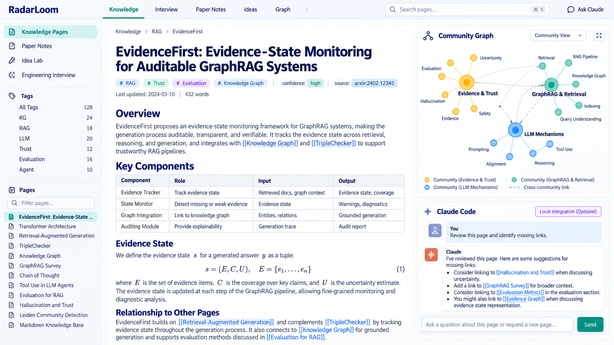
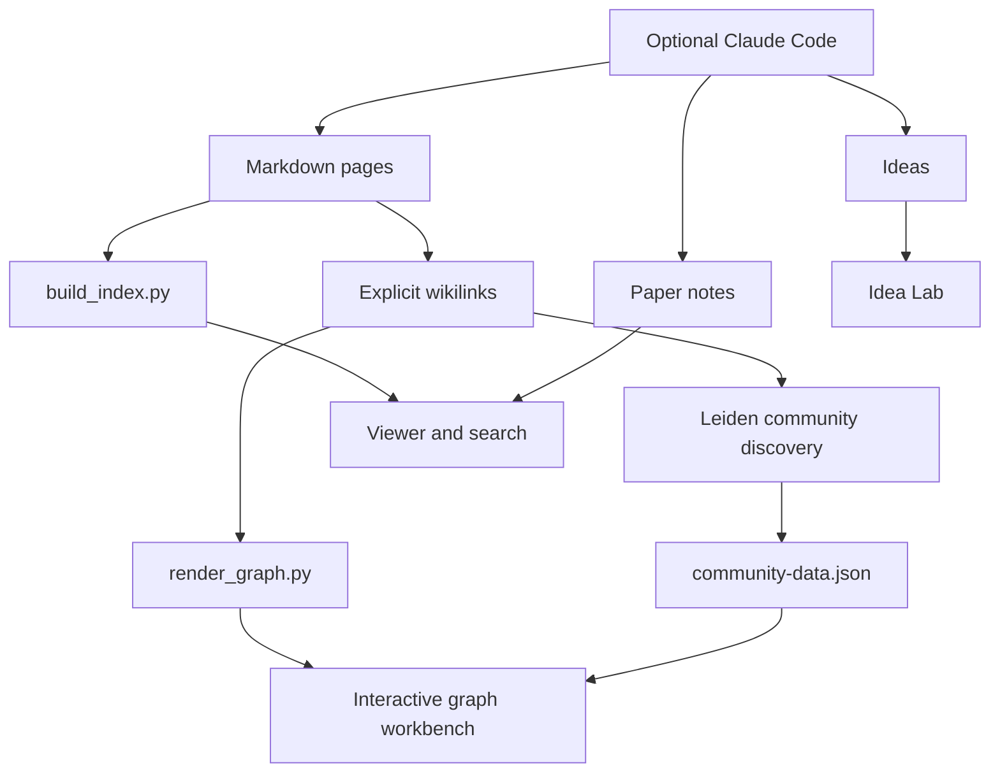
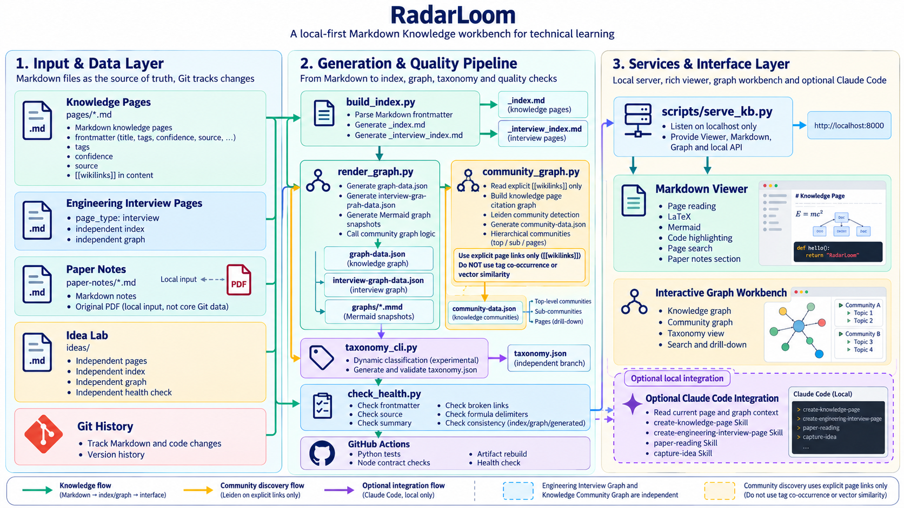

# RadarLoom

[English](README.md) · [中文](README.zh-CN.md)

RadarLoom is a local-first technical knowledge workspace built around Markdown, Git, and explicit links.

It turns notes, paper reading, interview preparation, ideas, and project knowledge into a searchable workspace with link graphs and automatically discovered communities. The source of truth remains the Markdown files. Indexes, graph data, taxonomy state, and community summaries are generated artifacts that can be rebuilt and reviewed.

中文名：技术知识织图。

## Why RadarLoom

Most note tools stop at folders and full-text search. RadarLoom keeps the files portable and adds the structure that grows out of them:

- Markdown pages with frontmatter, sources, confidence, tags, and `[[wikilinks]]`.
- A Viewer with Markdown, LaTeX, Mermaid, tables, code highlighting, search, favorites, history, export, and reading progress.
- A relationship graph built from explicit page references.
- Leiden community discovery over knowledge-page links, with hierarchical drill-down and generated community summaries.
- Separate workspaces for knowledge pages, engineering interview questions, paper notes, and Ideas.
- Optional Claude Code integration for retrieval, page creation, interview pages, paper reading, and Idea organization.
- Health checks, reproducible generated artifacts, local backups, API endpoints, and GitHub Actions.

The repository can run as a standalone Markdown knowledge base. Claude Code and its WebUI are optional local integrations.

## Product overview

This concept mockup shows the intended desktop workflow: browse knowledge pages, inspect the community graph, and optionally ask Claude to work with the current page.



## Architecture





## Quick start

Requirements:

- Python 3.11 or newer
- Node.js 20 or newer for JavaScript checks
- A modern browser

Clone the repository and install the taxonomy and graph dependencies:

```bash
git clone <your-repository-url>
cd radar-loom
python3 -m pip install -r requirements-taxonomy.txt
npm ci
```

Build the local indexes and graph artifacts:

```bash
python3 scripts/build_index.py
python3 scripts/render_graph.py
python3 scripts/check_health.py
python3 scripts/taxonomy_cli.py validate
```

Start the local knowledge-base server:

```bash
python3 scripts/serve_kb.py --host 127.0.0.1 --port 18081 --directory .
```

Open:

- Viewer: `http://127.0.0.1:18081/viewer.html`
- Interactive graph: `http://127.0.0.1:18081/graph-view.html`
- Community drill-down: `http://127.0.0.1:18081/graph-view.html?mode=community`
- Paper notes: `http://127.0.0.1:18081/viewer.html?section=notes`
- Idea Lab: `http://127.0.0.1:18081/ideas/viewer.html`

The browser assets are vendored under `vendor/`. If you need to refresh them, run `bash scripts/vendor_web_assets.sh`. Set `WEBUI_VENDOR` when you also maintain the optional external Claude WebUI integration.

## Workspaces

### Knowledge pages

Concept pages live in `pages/`. Each page describes one concept and records its source, confidence, tags, and links to existing pages. New pages should go through the `create-knowledge-page` Skill or the CLI template:

```bash
python3 scripts/new_page.py "Concept Name EnglishName" \
  --tags KG \
  --summary "What this page explains" \
  --source "https://example.com/source" \
  --confidence 中
```

### Engineering interview pages

Interview pages remain in `pages/` but use `page_type: interview` and a separate index, graph, taxonomy, and creation Skill. They do not enter the knowledge-page community graph.

### Paper notes

Paper notes live in `paper-notes/` and are rendered in their own Viewer section. The original PDFs are local inputs and are ignored by Git by default. Use the `paper-reading` Skill to create a note with source locations, claims, limitations, and follow-up questions.

Knowledge pages may retain references to local files under `papers/` or `raw/`. Those inputs are optional and can be omitted from a public clone; the health check keeps the page metadata valid without requiring private source files.

### Idea Lab

Ideas live under `ideas/` with their own pages, index, graph, health check, and `capture-idea` Skill. They do not modify the main knowledge-page taxonomy.

## Graph and taxonomy model

The page graph uses only explicit references:

```text
Page A [[Page B]]  ->  A -> B
```

Knowledge communities are discovered from knowledge-page links. Project pages, MOC pages, and interview pages stay outside this graph. Leiden uses the explicit-link graph as its input; the generated community data is stored in `community-data.json`. The graph UI starts at the top-level communities and renders child communities or member pages only after the user drills down.

The legacy taxonomy system remains available for dynamic category experiments. Its registry is stored in `taxonomy.json` and can be validated or rebuilt independently.

Static tags remain on pages as historical evidence. Dynamic automatic assignments, or 自动归属, live in `taxonomy.json`, so a taxonomy run does not rewrite page frontmatter.

## Common commands

| Command | Purpose |
| --- | --- |
| `python3 scripts/build_index.py` | Rebuild knowledge and interview indexes |
| `python3 scripts/render_graph.py` | Rebuild page graphs, community data, and Mermaid snapshots |
| `python3 scripts/check_health.py` | Check metadata, links, formulas, indexes, and generated artifacts |
| `python3 scripts/community_graph.py` | Rebuild knowledge communities alone |
| `python3 scripts/taxonomy_cli.py validate` | Validate the taxonomy registry |
| `python3 scripts/local_backup.py create` | Create a local backup |
| `python3 scripts/doctor.py` | Diagnose local dependencies and services |
| `python3 ideas/scripts/check_idea_health.py` | Check the Idea Lab |

## Testing and CI

Run the public repository checks locally:

```bash
npm run refresh:artifacts
npm run test:python
node scripts/ci_node_checks.mjs
```

GitHub Actions runs Python 3.11 and 3.12 tests, Node 20 and 22 contract checks, and a clean artifact and health-check job. Tests that require an external Claude WebUI are skipped unless the local control script is explicitly configured.

## Optional Claude Code integration

RadarLoom can be used without Claude. To add the local integration, install Claude Code and a compatible Claude WebUI separately, then point the WebUI working directory at this repository. The repository contains project-level Skills and prompt contracts, but never stores API keys, session state, or the external WebUI installation.

The local deployment manual is [Web 操作台使用与维护说明书](Web操作台使用与维护说明书.md). Its `<repo-root>` and `<local-webui-root>` values are placeholders for your machine.

## Data and privacy

The repository is designed for personal local knowledge, so review the content before publishing it. Keep private notes, original PDFs, backups, logs, credentials, and other people’s project material out of a public fork. See [SECURITY.md](SECURITY.md) and [docs/GITHUB发布清单.md](docs/GITHUB发布清单.md).

The source files are Markdown. Generated indexes and graph files are intentionally committed when they are useful for browsing and review. They can be recreated with the commands above.

## Contributing

See [CONTRIBUTING.md](CONTRIBUTING.md) for page conventions, checks, and pull-request expectations.

## License

The code and project documentation are released under the [MIT License](LICENSE). Knowledge pages and attached materials may have their own source and copyright terms; check the source metadata before redistributing them.
