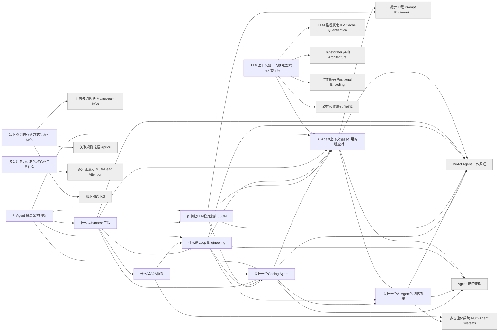

# 工程面试 · 隔离图谱

> 生成:2026-08-21 · 内部节点 11 · 边 43 · 断链 56

```mermaid
graph LR
    AI_Agent上下文窗口不足的工程应对["AI Agent上下文窗口不足的工程应对"]
    Agent_记忆架构["Agent 记忆架构"]:::ext
    LLM_推理优化_KV_Cache_Quantization["LLM 推理优化 KV Cache Quantization"]:::ext
    LLM上下文窗口的确定因素与超限行为["LLM上下文窗口的确定因素与超限行为"]
    Pi_Agent_底层架构剖析["Pi Agent 底层架构剖析"]
    ReAct_Agent_工作原理["ReAct Agent 工作原理"]:::ext
    Transformer_架构_Architecture["Transformer 架构 Architecture"]:::ext
    主流知识图谱_Mainstream_KGs["主流知识图谱 Mainstream KGs"]:::ext
    什么是A2A协议["什么是A2A协议"]
    什么是Harness工程["什么是Harness工程"]
    什么是Loop_Engineering["什么是Loop Engineering"]
    位置编码_Positional_Encoding["位置编码 Positional Encoding"]:::ext
    关联规则挖掘_Apriori["关联规则挖掘 Apriori"]:::ext
    多头注意力_Multi_Head_Attention["多头注意力 Multi-Head Attention"]:::ext
    多头注意力机制的核心作用是什么["多头注意力机制的核心作用是什么"]
    多智能体系统_Multi_Agent_Systems["多智能体系统 Multi-Agent Systems"]:::ext
    如何让LLM稳定输出JSON["如何让LLM稳定输出JSON"]
    提示工程_Prompt_Engineering["提示工程 Prompt Engineering"]:::ext
    旋转位置编码_RoPE["旋转位置编码 RoPE"]:::ext
    知识图谱_KG["知识图谱 KG"]:::ext
    知识图谱的存储方式与索引优化["知识图谱的存储方式与索引优化"]
    设计一个AI_Agent的记忆系统["设计一个AI Agent的记忆系统"]
    设计一个Coding_Agent["设计一个Coding Agent"]
    AI_Agent上下文窗口不足的工程应对 --> Agent_记忆架构
    AI_Agent上下文窗口不足的工程应对 --> ReAct_Agent_工作原理
    AI_Agent上下文窗口不足的工程应对 --> 提示工程_Prompt_Engineering
    AI_Agent上下文窗口不足的工程应对 --> 设计一个AI_Agent的记忆系统
    LLM上下文窗口的确定因素与超限行为 --> AI_Agent上下文窗口不足的工程应对
    LLM上下文窗口的确定因素与超限行为 --> LLM_推理优化_KV_Cache_Quantization
    LLM上下文窗口的确定因素与超限行为 --> Transformer_架构_Architecture
    LLM上下文窗口的确定因素与超限行为 --> 位置编码_Positional_Encoding
    LLM上下文窗口的确定因素与超限行为 --> 旋转位置编码_RoPE
    Pi_Agent_底层架构剖析 --> AI_Agent上下文窗口不足的工程应对
    Pi_Agent_底层架构剖析 --> 什么是Harness工程
    Pi_Agent_底层架构剖析 --> 什么是Loop_Engineering
    Pi_Agent_底层架构剖析 --> 如何让LLM稳定输出JSON
    Pi_Agent_底层架构剖析 --> 设计一个Coding_Agent
    什么是A2A协议 --> 什么是Loop_Engineering
    什么是A2A协议 --> 多智能体系统_Multi_Agent_Systems
    什么是A2A协议 --> 设计一个Coding_Agent
    什么是Harness工程 --> AI_Agent上下文窗口不足的工程应对
    什么是Harness工程 --> ReAct_Agent_工作原理
    什么是Harness工程 --> 什么是A2A协议
    什么是Harness工程 --> 什么是Loop_Engineering
    什么是Harness工程 --> 如何让LLM稳定输出JSON
    什么是Harness工程 --> 设计一个Coding_Agent
    什么是Loop_Engineering --> AI_Agent上下文窗口不足的工程应对
    什么是Loop_Engineering --> Agent_记忆架构
    什么是Loop_Engineering --> ReAct_Agent_工作原理
    什么是Loop_Engineering --> 设计一个AI_Agent的记忆系统
    什么是Loop_Engineering --> 设计一个Coding_Agent
    多头注意力机制的核心作用是什么 --> 多头注意力_Multi_Head_Attention
    如何让LLM稳定输出JSON --> AI_Agent上下文窗口不足的工程应对
    如何让LLM稳定输出JSON --> ReAct_Agent_工作原理
    如何让LLM稳定输出JSON --> 提示工程_Prompt_Engineering
    如何让LLM稳定输出JSON --> 设计一个Coding_Agent
    知识图谱的存储方式与索引优化 --> 主流知识图谱_Mainstream_KGs
    知识图谱的存储方式与索引优化 --> 关联规则挖掘_Apriori
    知识图谱的存储方式与索引优化 --> 知识图谱_KG
    设计一个AI_Agent的记忆系统 --> Agent_记忆架构
    设计一个AI_Agent的记忆系统 --> ReAct_Agent_工作原理
    设计一个AI_Agent的记忆系统 --> 多智能体系统_Multi_Agent_Systems
    设计一个Coding_Agent --> AI_Agent上下文窗口不足的工程应对
    设计一个Coding_Agent --> Agent_记忆架构
    设计一个Coding_Agent --> ReAct_Agent_工作原理
    设计一个Coding_Agent --> 设计一个AI_Agent的记忆系统
    classDef ext fill:#eee,stroke:#999;
```
