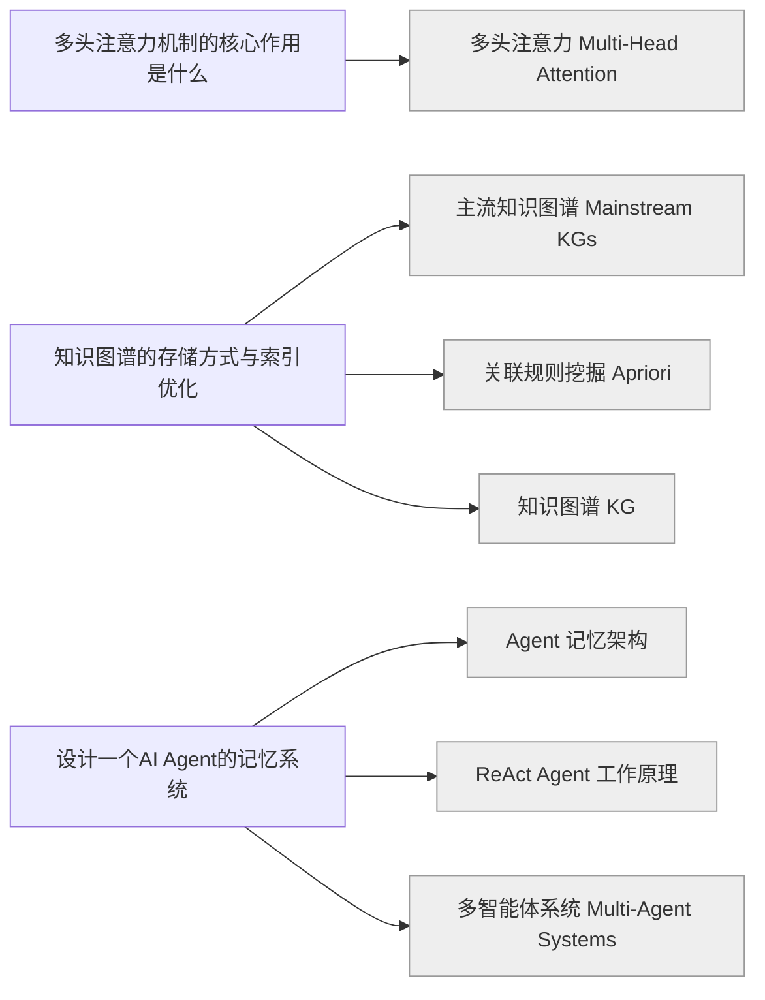

# 工程面试 · 隔离图谱

> 生成:2026-07-31 · 内部节点 3 · 边 7 · 断链 12

```mermaid
graph LR
    Agent_记忆架构["Agent 记忆架构"]:::ext
    ReAct_Agent_工作原理["ReAct Agent 工作原理"]:::ext
    主流知识图谱_Mainstream_KGs["主流知识图谱 Mainstream KGs"]:::ext
    关联规则挖掘_Apriori["关联规则挖掘 Apriori"]:::ext
    多头注意力_Multi_Head_Attention["多头注意力 Multi-Head Attention"]:::ext
    多头注意力机制的核心作用是什么["多头注意力机制的核心作用是什么"]
    多智能体系统_Multi_Agent_Systems["多智能体系统 Multi-Agent Systems"]:::ext
    知识图谱_KG["知识图谱 KG"]:::ext
    知识图谱的存储方式与索引优化["知识图谱的存储方式与索引优化"]
    设计一个AI_Agent的记忆系统["设计一个AI Agent的记忆系统"]
    多头注意力机制的核心作用是什么 --> 多头注意力_Multi_Head_Attention
    知识图谱的存储方式与索引优化 --> 主流知识图谱_Mainstream_KGs
    知识图谱的存储方式与索引优化 --> 关联规则挖掘_Apriori
    知识图谱的存储方式与索引优化 --> 知识图谱_KG
    设计一个AI_Agent的记忆系统 --> Agent_记忆架构
    设计一个AI_Agent的记忆系统 --> ReAct_Agent_工作原理
    设计一个AI_Agent的记忆系统 --> 多智能体系统_Multi_Agent_Systems
    classDef ext fill:#eee,stroke:#999;
```
