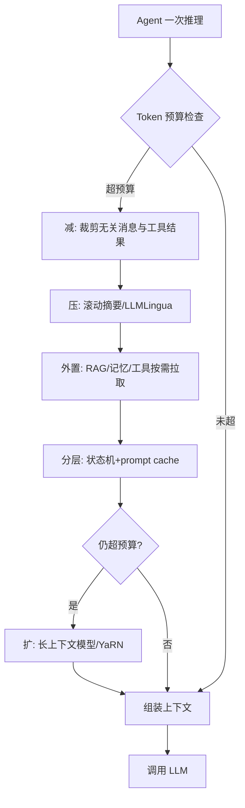

# AI Agent上下文窗口不足的工程应对

## 面试问题

AI Agent system 的 Context Window 不够用怎么办？请说明工程上的应对策略、取舍和失败模式。

## 考察意图

1. **问题分层：** 能否区分"装不下"和"用不好"，并按减、压、外置、分层、扩五条路径给方案，而不是只说"换长上下文模型"。
2. **机制理解：** 是否理解 lost-in-the-middle、注意力稀释、摘要幻觉等长上下文固有缺陷，而不是把窗口当内存。
3. **工程链路：** 能否把 token 预算、压缩、检索、缓存、状态机注入串成可落地的流水线。
4. **取舍意识：** 能否在成本、延迟、召回率、新鲜度、确定性之间做权衡。
5. **边界判断：** 知道何时该扩窗口（长文档/代码库分析），何时不该扩（多轮对话、状态外置更优）。

## 30 秒回答

1. **结论：** 上下文不够是工程问题不是模型问题，按"**减、压、外置、分层、扩**"五步组合，而不是直接换 1M token 模型。
2. **主链路：** 先裁剪无关 system prompt 和历史，再用滚动摘要压缩旧消息，把工具结果、文档、历史对话外置到 RAG/记忆库按需检索，用 prompt cache 和状态机决定每步注入什么，仍装不下时才上长上下文模型或位置编码扩展。
3. **关键取舍：** 长上下文不免费——成本随 token 线性甚至超线性增长、存在 lost-in-the-middle 与注意力稀释；摘要会丢细节并引入幻觉，必须保留指针回原文；外置检索要承担召回率风险。核心目标是用最小 token 让模型在对的时刻看到对的信息。

*图：五步不是顺序瀑布而是预算驱动的漏斗——大多数请求在"减+压+外置+分层"四层就解决，只有长尾真正调用长上下文模型。*

## 2 分钟回答

**先纠正一个认知：** 上下文窗口不是越大越好。Liu et al. 2023 的 lost-in-the-middle 实验表明，模型对位于上下文中部的信息利用率显著低于开头和结尾；塞得越多，注意力越稀释，成本和延迟越高。所以"换长上下文模型"是最后选项，不是第一选项。

**减：在写入 prompt 前就砍掉无关内容。** system prompt 只放跨任务稳定的指令和约束，不放业务数据；工具定义只注册当前状态可达的工具（state machine 控制可见工具集）；对话历史只保留最近 N 轮加上带决策的关键轮；工具结果大段 JSON 不要原样回灌，先由调用方抽取出模型下一步真正需要的字段。

**压：把旧信息浓缩成高密度表示。** 滚动摘要（compaction）在对话超过阈值时，用一次小模型调用把旧消息压成一段带时间戳和决策点的摘要，替换原始消息；对文档和检索片段可用 LLMLingua 系列做 token 级压缩，最高 20 倍压缩比并缓解 lost-in-the-middle。压缩必须保留回到原文的指针（message ID、文档 chunk ID），便于模型需要细节时回查。

**外置：让上下文从"全量携带"变成"按需加载"。** 这是 Agent 和普通 chatbot 最核心的区别。工具结果、长文档、历史会话、用户档案全部存到外部系统（向量库、KG、数据库、对象存储），上下文里只放引用句柄和摘要；模型通过工具调用或 RAG 检索"换入"需要的片段。MemGPT/Letta 把这套思路抽象成 OS 虚拟内存：主上下文是 RAM，archival memory 是磁盘，LLM 自己发函数调用决定换页。

**分层：用状态机和缓存组织上下文。** 不同 Agent 步骤需要的信息不同——规划阶段要任务目标和可用工具，执行阶段要当前工具的 schema 和上一步结果，反思阶段要错误日志和成功标准。用显式状态机决定每一步拼哪些段，而不是一个超级 prompt 打天下。Prompt Caching 把稳定前缀（system prompt、工具定义、长文档）缓存下来，Anthropic 的缓存读取价格是输入的 10%，TTL 5 分钟，100M token 容量，既降本又降延迟，但不增加有效信息容量。

**扩：最后才动模型和位置编码。** 真正需要长上下文的场景是整篇论文/代码库分析、长合同审阅、多文档比较。选项包括换 200K/1M token 模型、用 YaRN/Position Interpolation 扩展开源模型上下文、或用 sliding window attention 降低长序列的显存开销。但要同时评估成本（长上下文输入每次都计费）、延迟（prefill 时间随序列长度增长）和有效利用率（middle 信息是否真被用上）。

**失败模式必须主动监控。** 摘要与压缩会引入幻觉和信息丢失，必须保留指针并在关键决策点回查原文；RAG 召回率不是 100%，需要混合检索、重排和"检索不到就承认"的兜底；长上下文任务必须做 needle-in-haystack 测试验证模型有效利用范围，而不是只看标称窗口。

## 原理拆解

### 1. 五条路径对比

| 路径 | 做法 | 解决什么 | 成本/风险 | 典型场景 |
| --- | --- | --- | --- | --- |
| 减 | 裁剪 system prompt、历史、工具结果 | 无关内容稀释注意力 | 可能误删关键上下文 | 多轮对话、工具调用 |
| 压 | 滚动摘要、LLMLingua token 压缩 | 旧消息累积 | 摘要幻觉、丢细节 | 长对话、长文档片段 |
| 外置 | RAG、记忆库、工具结果存储 | 状态/文档超出窗口 | 召回率、检索延迟 | Agent 长期任务、知识库问答 |
| 分层 | 状态机注入、prompt caching | 不同步骤需要不同信息 | 工程复杂度、cache miss | 多步 Agent、多工具系统 |
| 扩 | 长上下文模型、YaRN、SWA | 必须整篇输入的任务 | 成本、延迟、lost-in-middle | 代码库分析、合同审阅 |

### 2. 上下文预算公式

每次请求前估算：

$$B_{\text{可用}} = W_{\text{模型}} - B_{\text{系统}} - B_{\text{工具}} - B_{\text{输出预留}}$$

其中 $B_{\text{输出预留}}$ 通常取 `max_tokens` 的 1.2 倍以容纳估计误差。剩余预算按优先级分配：当前用户消息 > 当前任务状态 > 最近 N 轮对话 > 检索片段 > 历史摘要。超预算时按上表从"减"到"扩"逐级触发。

### 3. 滚动摘要的安全做法

1. **触发：** 消息 token 数超过阈值（如窗口的 60%）时触发，留足输出空间。
2. **分段：** 保留最近 K 轮原文（短期记忆不压缩），把更早的消息压成摘要。
3. **结构化摘要：** 不用自然语言大段叙述，而是抽取"决策点、未完成任务、用户约束、关键事实 ID"四类结构化字段。
4. **保留指针：** 每条摘要事实带 `message_id` 或 `event_id`，模型可通过工具回查原文。
5. **渐进压缩：** 已压缩的旧摘要可以二次压缩为高层摘要，形成层级结构（类似 Generative Agents 的 reflection）。
6. **验证：** 压缩后跑一次"关键事实召回"自检——从摘要中能否还原出预先标注的关键事实。

### 4. Prompt Caching 的正确定位

- **缓存解决的是成本和延迟，不是窗口容量。** 缓存的前缀仍计入上下文 token 数，超窗口照样报错。
- **适合缓存：** system prompt、工具定义、长文档、稳定的 few-shot 示例。
- **不适合缓存：** 频繁变化的当前对话、时间敏感数据。
- **断点设计：** 在稳定段和易变段之间打断，例如 system prompt + 工具定义一个 cache block，检索文档一个 cache block，对话历史不缓存。
- **缓存写 1.25x、读 0.1x：** 只有命中足够多次（>10 次）才摊薄写成本，TTL 5 分钟内需有持续访问。

### 5. 长上下文为什么不能解决所有问题

- **Lost in the middle：** 多份实验显示模型对中间位置信息的召回率比首尾低 10–30 个百分点。
- **注意力稀释：** 信息越多，模型越难判断哪些与当前决策相关。
- **成本非线性：** 部分模型长上下文档单价更高；prefill 计算量随序列长度至少线性增长。
- **有效窗口 < 标称窗口：** 标称 128K 不代表模型在第 100K 的位置还能稳定取出事实，需用 needle-in-haystack 实测。
- **位置编码外推：** YaRN/PI 等扩展训练后，模型在扩展区域的性能通常弱于原生训练区域。

### 6. Agent 特有的上下文来源

普通 chatbot 上下文只有 system + 历史；Agent 还要管理这些来源：

- **工具定义**：十几个工具的 JSON Schema 可能占数千 token，按状态裁剪。
- **工具结果**：API 返回、代码执行输出、检索片段，最大且最容易膨胀。
- **Scratchpad/思考链**：ReAct 的 thought-action-observation 序列累积很快。
- **记忆检索结果**：从情景/语义记忆拉回的片段。
- **子 Agent 输出**：多 Agent 系统中其他 agent 的中间产物。

原则：**工具结果不要原样回灌**，由编排层抽取下一步所需字段；长输出存对象存储，上下文只放 URI + 摘要 + 关键统计。

## 递进追问与参考回答

### Q1：直接用 200K/1M 上下文模型不就解决了，为什么还要做这些工程？

长上下文模型解决的是"装得下"，没解决"用得好、用得起"。第一，成本——200K 输入每次请求都按 200K 计费，多轮对话累加下来比 RAG 贵一个数量级；第二，延迟——prefill 200K token 在多数模型上要数秒到十几秒，影响交互体验；第三，准确率——lost-in-the-middle 和注意力稀释让中间信息利用率显著下降，标称窗口不等于有效窗口；第四，许多信息（如用户历史、知识库）本就不该每轮重传，外置后按相关性检索更高效。长上下文适合"必须整篇可见"的任务（代码库分析、长合同审阅），不适合多轮对话和可外置状态。

### Q2：滚动摘要怎么做才不会把关键信息压没了？

四件事：一是**结构化摘要**，强制输出决策点、未完成任务、用户约束、关键事实 ID 四类字段，比自由文本摘要信息密度高；二是**保留原文指针**，每条摘要带 `message_id`，模型可通过工具回查；三是**不压最近 K 轮**，短期细节留在原文里，避免摘要误差影响即时决策；四是**压缩后自检**，用一次小模型调用或规则检查，确认预先标注的关键事实仍可从摘要中还原。摘要本质是有损压缩，不能假设它无损，关键决策必须允许回查原文。

### Q3：Prompt Caching 能省 token 吗？它和上下文窗口是什么关系？

不能省窗口容量，只能省成本和延迟。缓存的前缀仍然占用上下文 token 配额，超窗口照样报错。它的价值在于：稳定前缀（system prompt、工具定义、长文档）只在第一次请求时付 1.25x 写入费，后续命中按 0.1x 收费并跳过 prefill，延迟降约 2 倍。适合多轮对话、共享大文档的多用户场景；不适合一次性请求或前缀频繁变化的场景。把缓存和 RAG/摘要配合：稳定大文档走缓存，动态历史走摘要，检索片段走即时注入。

### Q4：外置到 RAG 后检索不到相关内容怎么办？

三层兜底。**检索层**：用混合检索（向量 + BM25 + 元数据过滤）+ cross-encoder 重排提升召回；对 Agent 场景可以让模型自己生成多个查询（query rewriting）或用 HyDE。**应用层**：检索分数低于阈值时不强行注入低质片段，而是让模型显式说"我没有足够信息"并触发工具调用或追问用户。**评估层**：离线构建召回测试集，监控 recall@k、nDCG 和最终任务成功率；检索失败的 case 回灌到索引或加权威文档。RAG 不是银弹，必须把"检索不到"作为一等公民设计，而不是默认检索总是成功。

### Q5：MemGPT 的分页和 RAG 有什么本质区别？

控制权不同。RAG 是应用层在每次请求前决定检索什么、注入什么，模型被动接收；MemGPT 让 LLM 自己通过函数调用（`core_memory_append`、`archival_memory_search`、`archival_memory_insert`）决定何时把旧内容换出、何时搜索外部存储、何时把结果换入主上下文，类似 OS 的虚拟内存和缺页中断。适合长时运行、自主性强的 Agent；不适合需要严格确定性注入的场景（合规、客服），因为模型可能不检索或检索错。工程上两者可以混合：确定性信息由应用层强制注入，探索性信息由模型自主分页。

### Q6：怎么判断什么放 system prompt、什么放工具、什么放记忆？

按"变化频率 + 使用范围 + 确定性"三轴判断。**System prompt**：跨任务稳定、所有步骤都要看到、确定性强的指令（安全约束、输出格式、角色定义）。**工具**：按需调用、使用范围窄、输入输出结构化的能力（查数据库、调 API、执行代码）；"just-in-time tool"原则——能通过工具拿到的信息就不要常驻 prompt。**记忆**：跨会话累积、按相关性检索的个性化信息（用户偏好、历史事件）。**当前上下文**：本任务状态、最近对话、scratchpad。一条经验法则：如果一段信息在每次请求中都用到且基本不变，放 system；如果只在某些步骤用到，做成工具；如果因人而异且随时间累积，放记忆。

### Q7：多 Agent 协作时上下文怎么管理？

核心原则是**不共享全部上下文，只共享结构化消息**。每个 agent 有独立上下文窗口，通过黑板（blackboard）或消息总线传递任务、结果和错误；传递的不是完整对话历史，而是结构化的产物（决策、文件、代码 diff、关键事实）。子 agent 的长输出存对象存储，父 agent 只拿到 URI + 摘要 + 关键统计，需要细节时再拉取。还要防止上下文污染：一个 agent 的错误结论不要无条件进入另一个 agent 的上下文，应附带来源和置信度，由接收方判断是否采信。

## 常见错误回答

- **"换个 1M token 的模型就好了"**：忽视成本、延迟和 lost-in-the-middle；长上下文是最后选项不是第一选项。
- **"把所有历史对话都塞进上下文"**：既受窗口限制又稀释注意力，多轮对话成本指数级增长。
- **"用 RAG 就够了"**：RAG 解决外置检索，但不解决 system prompt 膨胀、工具结果累积、scratchpad 增长等 Agent 特有问题；且召回率不是 100%。
- **"摘要完就把原文删掉"**：摘带有损压缩和幻觉风险，必须保留指针链回原文。
- **"Prompt Caching 能扩大窗口"**：缓存只降本提速，缓存的 token 仍计入窗口配额。
- **"工具结果原样回灌给模型"**：大段 JSON/日志是上下文膨胀的主因，应由编排层抽取字段或外置存储。
- **"标称 128K 就能用满 128K"**：有效窗口通常小于标称窗口，需用 needle-in-haystack 实测模型在各位置的召回率。
- **"一个超级 system prompt 管所有步骤"**：不同 Agent 步骤需要不同信息，应该用状态机按需注入。

## 评分标准

**不合格（0–2）**

- 只回答"换长上下文模型"或"用 RAG"，说不出其他路径；
- 不知道 lost-in-the-middle、摘要幻觉等长上下文固有问题；
- 完全不考虑成本、延迟和召回率取舍。

**合格（3–4）**

- 能说出至少 3 条路径（如裁剪、摘要、RAG）并解释适用场景；
- 知道长上下文有代价，提到 lost-in-the-middle 或注意力稀释；
- 能描述滚动摘要和工具结果外置的基本做法；
- 提到至少 2 个工程取舍（成本、延迟、召回率、新鲜度）。

**优秀（5–6）**

- 能系统讲清"减、压、外置、分层、扩"五条路径及优先级；
- 能解释 MemGPT 分页与 RAG 的控制权差异、prompt caching 的适用边界；
- 能给出 token 预算公式、滚动摘要安全做法、长上下文有效窗口验证方法；
- 能针对多 Agent 上下文污染、工具结果膨胀、检索失败兜底给出具体方案；
- 理解外置信息的召回率风险和"检索不到就承认"的设计原则。

**加分项**

- 提到 LLMLingua 等 token 级压缩、YaRN/PI 等位置编码扩展、sliding window attention；
- 能讨论上下文工程（context engineering）作为独立工程学科的趋势；
- 了解多 Agent 黑板模式与结构化消息传递；
- 有实际监控 token 使用率、cache 命中率、检索召回率和任务成功率联动的经验。

## 关联概念

- [[Agent 记忆架构]]
- [[设计一个AI Agent的记忆系统]]
- [[ReAct Agent 工作原理]]
- [[提示工程 Prompt Engineering]]
- [[检索增强生成 RAG-GraphRAG]]
- [[混合检索 Hybrid Retrieval]]
- [[多智能体系统 Multi-Agent Systems]]

## 来源核验

来源：

- Anthropic, *Effective Context Engineering for Agents*, 2025, https://www.anthropic.com/engineering/effective-context-engineering-for-agents （"keep only what you need / keep it structured / keep it up to date / refer to things by name" 四原则，compaction、just-in-time tools、状态机注入等工程实践的一手来源）
- Liu et al., *Lost in the Middle: How Language Models Use Long Contexts*, TACL 2024, https://arxiv.org/abs/2307.03172 （长上下文信息利用率随位置下降的经典实验依据）
- Packer et al., *MemGPT: Towards LLMs as Operating Systems*, 2023, https://arxiv.org/abs/2310.08560 （主上下文/archival memory 分页、函数调用换页的一手来源）
- Jiang et al., *LongLLMLingua: Accelerating and Enhancing LLMs in Long Context Scenarios via Prompt Compression*, 2023, https://arxiv.org/abs/2310.06839 （prompt 压缩与 lost-in-the-middle 缓解的一手来源）
- Anthropic, *Prompt Caching 官方文档*, https://docs.anthropic.com/en/docs/build-with-claude/prompt-caching （缓存容量、TTL、读写计价、断点设计的权威来源）

信度：高。Anthropic 工程文章和官方文档是工业界一手实践；Liu et al. 为 TACL 同行评审论文；MemGPT 和 LongLLMLingua 为被广泛引用的 arXiv 论文。各来源之间在"上下文不是越大越好、需要分层管理"这一点上口径一致。

## 更新记录

- 2026-08-02: 首次建页
