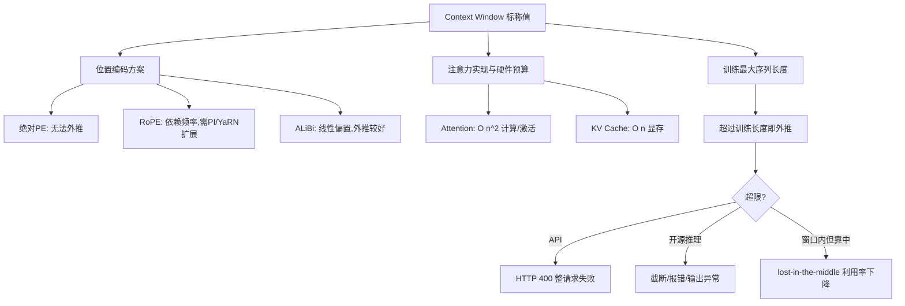

# LLM上下文窗口的确定因素与超限行为

## 面试问题

LLM 的 Context Window 是怎么确定的？为什么会有上限？超过之后会发生什么？

## 考察意图

1. **机制理解：** 能否说清窗口大小由训练序列长度、位置编码和注意力实现共同决定，而不是一个玄学数字。
2. **复杂度分析：** 能否从 attention 的 $O(n^2)$ 计算、KV Cache 的 $O(n)$ 显存、位置编码外推三个层面解释上限的物理根源。
3. **外推与扩展：** 是否了解 RoPE/ALiBi/绝对 PE 在训练长度外的退化差异，以及 Position Interpolation、YaRN 等扩展技术。
4. **超限行为：** 能否区分 API 400 报错、SDK 静默截断、开源模型崩溃三种情况，并知道 prompt 和 completion 共享预算。
5. **有效窗口意识：** 是否知道标称窗口不等于有效窗口，理解 lost-in-the-middle 和 needle-in-haystack 测试。

## 30 秒回答

1. **结论：** 上下文窗口不是模型卡上的一个数字，而是由**预训练时见过的最大序列长度、位置编码方案、以及注意力的计算/显存预算**三者共同锁定的；改窗口必须同时处理这三者。
2. **主链路：** Transformer 自注意力的计算量和激活显存随序列长度 $n$ 以 $O(n^2)$ 增长，推理时 KV Cache 以 $O(n)$ 增长，位置编码在超过训练长度后外推退化——这三股力量共同钉死了原生窗口；要扩大窗口就得换位置编码方案、做插值/NTK 扩展（PI、YaRN）、或换线性/稀疏注意力。
3. **超限行为：** 闭源 API 在 prompt 加预留 completion 合计超窗口时返回 HTTP 400，整请求失败；开源推理栈可能截断、报错或输出垃圾；而即使在窗口内，模型对中部信息的利用率也会下降（lost-in-the-middle），**标称窗口 ≠ 有效窗口**。

*图：上下文窗口由训练长度、位置编码、注意力预算三方共同决定，超限时按部署形态表现为报错、截断或质量退化。*

## 2 分钟回答

**先讲窗口是怎么"定"出来的。** 第一层是预训练数据：模型在训练时见过的最长序列 $L_{\text{train}}$ 是原生窗口的基础，绝对位置编码直接把位置表学到这个长度，超出就没有对应 embedding。第二层是位置编码方案：RoFormer 的 RoPE 用旋转角编码位置，角度随位置线性增长但频率按几何级数递减，训练只覆盖了 $\left[0, L_{\text{train}}\right)$ 的角度范围；ALiBi 不给位置 embedding，而是在 attention score 上加一个与距离成正比的惩罚，外推性天然更好；第三代方案如 NoPE/CoPE 进一步弱化位置。第三层是工程预算：attention 矩阵是 $n \times n$，$n=32\text{K}$ 时一张 A100 的激活显存就到 GB 量级，KV Cache 在长序列多并发下迅速吃满显存，这部分硬件约束最终也会反映到模型卡声明的窗口上。

**再讲为什么有上限。** 三个独立的限制。**计算复杂度上**，标准 self-attention 的 QK^T 和 AV 都是 $O(n^2 d)$，序列翻倍计算量翻四倍，prefill 延迟随序列长度近似平方增长（实际受带宽和 kernel 影响）。**显存上**，推理时除了模型权重，还要为每个未完成的序列存 KV Cache，每层每头都有 $n \times d$ 大小的 K 和 V，总大小为 $2 \cdot n \cdot L \cdot d_{\text{model}}$ 乘以精度字节数，且是按并发线性叠加的；这是长上下文推理最硬的显存墙。**位置外推上**，无论绝对位置 embedding 还是 RoPE 的旋转角，训练分布之外的位置都没被见过，模型可能输出乱码或性能崩塌；PI 通过线性下采样位置、YaRN 通过 NTK 感知的插值和温度调整，让模型在 2–8 倍训练长度上仍可用，但通常需要少量长序列继续微调。

**超过之后会发生什么，要分三种部署形态看。** 闭源 API（OpenAI、Anthropic 等）在 `prompt tokens` 加 `max_tokens` 合计超过窗口时直接返回 HTTP 400 `invalid_request_error`，整请求失败，不会替你截断；错误消息会同时告诉你模型窗口和你实际用了多少 token。开源服务栈（vLLM、TGI、llama.cpp 等）行为不一，有的强制截断最早的消息（sliding window），有的抛异常，有的在位置编码外推区直接生成垃圾。前端/SDK 层有时会做静默截断，这非常危险——你以为模型读了全文，实际只读到了一半。

**最后必须区分标称窗口和有效窗口。** Liu et al. 2023 的实验表明，模型对位于上下文中部的信息召回率显著低于首尾，多份后续研究显示在 100K+ 窗口里"找一根针"的成功率不是平的曲线。因此生产环境里要用 needle-in-haystack 实测有效窗口，并在应用层做预算管理，而不是假设标称窗口里每一个 token 都被有效利用。

## 原理拆解

### 1. 决定窗口大小的三个因素

| 因素 | 如何决定窗口 | 改窗口的代价 |
| --- | --- | --- |
| 训练最大序列长度 | 预训练时每个样本的最大 token 数；位置 embedding 表学到这个长度 | 必须重新预训练或长序列继续微调 |
| 位置编码方案 | 绝对 PE 锁死长度；RoPE 角度外推但性能下降；ALiBi 靠距离惩罚外推更好 | 换 PE 架构需要重训；扩展可用 PI/YaRN 等微调 |
| 注意力实现与硬件 | 标准 attention $O(n^2)$；FlashAttention 省激活显存但不省计算；sliding window / linear attention 降复杂度 | 换稀疏/线性注意力要改架构并重训 |

### 2. 三个上限的定量分析

设序列长度为 $n$，隐藏维 $d$，层数 $L$，注意力头数为 $h$（简单起见 $d_{\text{head}} = d/h$）。

- **Attention 计算量：** 每层 attention 的 QK^T 与 AV 共做两次矩阵乘，量级 $O(n^2 d)$；全模型 $O(L n^2 d)$。序列翻倍，prefill FLOPs 约翻四倍。
- **Attention 激活显存：** 标准实现需要存 $n \times n$ 的 attention score，每层 $O(n^2)$，FlashAttention 把它降到 $O(n)$，但不减少计算量。
- **KV Cache 显存：** 每 token 在每层存 K 和 V 两个 $d$ 维向量，单序列大小为

$$M_{\text{KV}} = 2 \cdot n \cdot L \cdot d \cdot b$$

其中 $b$ 是每参数字节数（FP16 为 2，INT8 为 1）。例如 $L=80, d=8192, n=32\text{K}, b=2$ 时单序列约 80 GB，这就是长上下文必须做 KV 量化、分页（PagedAttention）或 GQA/MQA 的原因。

### 3. 位置编码为什么会"卡住"窗口

- **绝对位置编码（原始 Transformer）：** 直接学习一个 $L_{\text{train}} \times d$ 的位置 embedding 表，位置 $i \ge L_{\text{train}}$ 根本没有对应行，外推不可能。
- **RoPE：** 通过旋转矩阵 $R_i$ 把位置 $i$ 注入 Q/K，旋转角频率为 $\theta_j^{-2k/d}$；相对位置依赖角度差。当 $i$ 远超训练长度，高频维度已经转过多个周期，低频维度的角度也偏离训练分布，attention 分数失真。
- **ALiBi：** 不加位置 embedding，在 attention score 上减去 $m \cdot |i-j|$。因为惩罚形式与长度无关，外推性显著好于 RoPE，但长距离依赖仍会被线性惩罚压制。

### 4. 扩展窗口的主流技术

| 技术 | 思路 | 是否需微调 | 典型扩展比 |
| --- | --- | --- | --- |
| Position Interpolation (PI) | 把位置索引线性下采样到训练范围内，让外推变内插 | 少量长序列微调 | 2–4 倍 |
| NTK-aware / NTK-by-parts | 按 RoPE 频率维度分别处理：高频不动、低频插值 | 可不微调或少量微调 | 4–8 倍 |
| YaRN | NTK 插值 + 注意力温度缩放 + 维度分组调度 | 少量微调 | 8–64 倍 |
| Longformer / BigBird | 稀疏注意力（局部窗口 + 全局/随机 token） | 需架构级训练 | 8 倍以上 |
| Sliding Window Attention（Mistral） | 每层只看局部窗口，层叠感受野指数增长 | 架构级训练 | 任意长度，代价是跨窗口依赖 |
| 继续预训练 | 直接在长序列（如 32K/128K）上继续训练 | 大量长序列 + 算力 | 原生支持目标长度 |

注意：扩展技术扩展的是**模型能处理的最大长度**，不保证在扩展区域的性能与原生区域一致；YaRN 论文也报告扩展越长，perplexity 越高。

### 5. 超限时的三种部署行为

1. **闭源 API（OpenAI、Anthropic、Google）：** 请求前按 tokenizer 统计 prompt 加 `max_tokens`，超窗口返回 HTTP 400 `invalid_request_error` 或等价错误码，**不截断、不兜底**。错误消息会给出模型窗口和实际 token 数。
2. **开源自建服务（vLLM、TGI、SGLang、llama.cpp）：** 行为由配置决定——可以配置为截断最早消息（sliding window / rolling buffer）、直接报错、或允许外推但输出质量不可控。生产环境应显式配置并监控。
3. **客户端/SDK 层：** 部分聊天框架在超限时静默裁掉最早的消息或整个 system prompt，这是最危险的行为，因为它不报错但会导致 system 指令失效。应在发送前用 tokenizer 自检。

无论哪种形态，预算都要为 completion 留空间：可用输入预算等于窗口大小减去 `max_tokens`（再加少量安全 margin，因为消息模板和特殊 token 也计数）。

### 6. 标称窗口 vs 有效窗口

- **标称窗口（claimed window）：** 模型卡声明的最大可处理长度，通常是架构上"能跑通"的长度。
- **有效窗口（effective window）：** 模型能稳定利用其中信息的长度，通常短于标称窗口。
- **Lost in the middle：** Liu et al. 在多段文档中插入一个相关片段，测量不同位置的召回率，发现呈 U 形曲线——开头和结尾高、中部低。
- **Needle-in-a-haystack：** 在长文本里插一句无关陈述，让模型回答，测试各深度位置的正确率；这是目前长上下文模型的标配压测。
- 工程含义：不要在 prompt 中部放关键指令或事实；长上下文场景必须对信息位置敏感，或重排让关键信息在首尾。

## 递进追问与参考回答

### Q1：RoPE 为什么不能直接外推，PI 和 YaRN 是怎么修的？

直接外推会让 RoPE 的旋转角跑到训练分布之外。具体来说，RoPE 用一组从高到低的频率 $\theta_j$，高频维度对应局部相对位置（训练时转过的角度小），低频维度对应长距离（训练时转过的角度大但仍在有限范围）。位置 $i > L_{\text{train}}$ 时高频维度已经转过多个完整周期，角度差失真，attention 分数失效。PI 的修法是把位置索引从 $[0, L_{\text{new}})$ 线性压缩到 $[0, L_{\text{train}})$，让所有位置都落在训练见过的角度范围内——把外推变成内插，但需要少量长序列微调让模型适应被压缩的位置分辨率。YaRN 进一步改进：对高频维度不插值（保留局部精度），对低频维度插值，并按温度 $\sqrt{t}$ 缩放 attention softmax 以补偿被压缩后的熵变化，配合少量微调能扩到 8–64 倍。

### Q2：KV Cache 显存到底有多大？为什么量化 KV 很关键？

对单条序列，KV Cache 大小为 $2 \cdot n \cdot L \cdot d \cdot b$ 字节，其中 $n$ 是序列长度、$L$ 是层数、$d$ 是隐藏维、$b$ 是字节数。以 Llama-3-8B（$L=32, d=4096$）为例，FP16 下 $n=8\text{K}$ 时单序列约 $2 \times 8192 \times 32 \times 4096 \times 2 \approx 4$ GB；$n=128\text{K}$ 时约 64 GB。这还只是**一条序列**，推理服务通常要并发几十条，KV Cache 会迅速超过模型权重本身（8B FP16 约 16 GB）。所以长上下文推理的核心工程就是 KV 优化：MQA/GQA 减少 KV 头数、KV INT8/FP8 量化、PagedAttention 减少碎片、跨请求前缀共享（prompt caching）。

### Q3：FlashAttention 不是把 attention 加速了吗，为什么还有上限？

FlashAttention 优化的是**显存访问**而不是**计算量**。标准 attention 需要把 $n \times n$ 的 score 矩阵写回 HBM 再读出来，FlashAttention 用 tiling 在 SRAM 里在线计算 softmax，把激活显存从 $O(n^2)$ 降到 $O(n)$，并显著减少 HBM 读写。但它没有改变 attention 的 FLOPs——QK^T 和 AV 仍然是 $O(n^2 d)$，所以 prefill 时间依然随序列长度近似平方增长；decode 阶段因每步只算一个 query，瓶颈在 KV 读取带宽而不是计算。换句话说，FlashAttention 让你**放得下**更长的 attention，但**算得动**的长度仍受 FLOPs 和 KV Cache 带宽限制。

### Q4：ALiBi 是不是就没有窗口上限了？

不是。ALiBi 去掉了位置 embedding 表，所以没有"位置表查不到"的硬墙，但它给 attention score 加了 $-m \cdot |i-j|$ 的线性距离惩罚。这个惩罚随距离线性增长，到一定距离后 attention weight 趋近于零，相当于模型"看不到"远处的 token——这是一种软窗口。ALiBi 的优势是外推性好：训练在 2K，推理到 4K–8K 时性能下降比 RoPE 平缓；但它不是无限窗口，长距离依赖仍受惩罚压制，而且不同头的斜率 $m$ 需要在训练时调好。

### Q5：为什么 API 不自动截断，非要返回 400？

自动截断会制造**静默错误**。如果 API 替你截掉最早的消息，可能恰好截掉 system prompt 里的关键安全约束，或者截掉用户的核心需求——模型仍然返回一个看似正常的回答，但已经偏离了任务，调用方却不知道。这种错误比直接 400 难排查得多。因此主流 API 选择把预算控制权交给调用方：你显式传 `max_tokens`，服务端检测 prompt 加 `max_tokens` 超窗口就直接失败，让你决定是裁剪、摘要还是换模型。客户端 SDK 如果默认做截断，应该视为反模式。

### Q6：标称 128K 的模型在第 100K 位置的信息它真的能用上吗？

不能默认能。标称窗口是架构和外推技术保证"能处理"的长度，不保证在每一个位置的信息都被有效利用。Liu et al. 的 lost-in-the-middle 实验显示 U 形利用率曲线；后续的 needle-in-a-haystack 测试也显示不同模型在不同深度位置的正确率有波动，部分模型在标称窗口内仍有显著的中部塌陷。生产环境必须自己做 needle-in-a-haystack 测试，并在 prompt 设计上把关键信息放在首尾、或通过重排/检索压缩让相关信息集中到模型利用率高的位置。

### Q7：如果一个业务场景需要 1M token 上下文，应该怎么选模型或架构？

先问是不是真的需要 1M **同层可见**。整篇代码库分析、全基因组、长合同审阅这类任务确实需要；多轮对话、知识库问答通常不需要，用 RAG/记忆外置更划算。真需要 1M 时，有三条路：一是用原生支持长上下文的模型（Gemini 1.5 Pro 等标称 1M–2M，但要按长上下文档溢价付费，并实测有效窗口）；二是用滑动窗口加全局 token 的架构（Longformer、BigBird、Mistral SWA 堆叠），把 $O(n^2)$ 降到 $O(n w)$；三是用 RAG/Agent 分层——主线程保持短上下文，把长文档切片存向量库，由模型按需检索。第三条路在成本和延迟上通常最优，但要承担召回率风险。

## 常见错误回答

- **"上下文窗口就是模型卡上写的那个数字"**：忽略了训练长度、位置编码、硬件预算三方共同决定的事实。
- **"FlashAttention 解决了长上下文问题"**：它优化了显存访问和激活显存，但没减少 $O(n^2)$ 计算量，也不解决 KV Cache 增长和位置外推。
- **"RoPE 可以无限外推"**：RoPE 外推会因旋转角越界失真，必须用 PI/YaRN 等扩展技术加少量微调。
- **"ALiBi 没有窗口限制"**：ALiBi 没有位置表硬墙，但线性距离惩罚形成软窗口，长距离依赖被压制。
- **"超过窗口 API 会自动截断"**：主流闭源 API 是直接 400 报错；静默截断是某些客户端框架的危险默认行为。
- **"prompt 用满窗口再留点 max tokens 就行"**：必须为 completion 预留完整 `max_tokens` 加 margin，因为 prompt 和 completion 共享预算。
- **"标称 128K 就能用满 128K"**：忽略 lost-in-the-middle 和有效窗口，中部信息利用率显著低于首尾。
- **"扩窗口只要换个位置编码就行"**：扩展后通常需要长序列继续微调，且扩展越长 perplexity 越高。
- **"KV Cache 只和模型大小有关"**：KV Cache 随并发和序列长度线性增长，长上下文下它往往比权重本身更吃显存。

## 评分标准

**不合格（0–2）**

- 说不出窗口由什么决定，只把它当成模型卡上的数字；
- 不知道 attention 的 $O(n^2)$ 复杂度和 KV Cache 的显存增长；
- 以为超过窗口 API 会自动截断，或不知道 prompt 和 completion 共享预算。

**合格（3–4）**

- 能说出训练长度、位置编码、注意力预算三个决定因素；
- 能解释 attention $O(n^2)$ 计算和 KV Cache $O(n)$ 显存；
- 知道 RoPE 外推退化、PI/YaRN 等扩展技术的存在；
- 知道 API 超限返回 400，并区分开源服务的不同行为；
- 听说过 lost-in-the-middle。

**优秀（5–6）**

- 能定量写出 KV Cache 显存公式并估算具体模型；
- 能讲清 RoPE 高频和低频维度在 PI、NTK、YaRN 下的不同处理；
- 理解 FlashAttention 优化的是 IO 不是 FLOPs，SWA/Longformer 降复杂度但要改架构；
- 能区分标称窗口、有效窗口、needle-in-haystack 测试方法；
- 能针对"需要 1M 上下文"的业务需求给出分层方案并讨论取舍。

**加分项**

- 提到 GQA/MQA 对 KV Cache 的缩减、PagedAttention 的碎片治理、prompt caching 的前缀共享；
- 能讨论 attention sink、StreamingLLM 等最近观察；
- 了解位置编码的最新进展（NoPE、CoPE）；
- 有实际做过 needle-in-haystack 或长上下文 perplexity 评测的经验。

## 关联概念

- [[Transformer 架构 Architecture]]
- [[Transformer 自注意力机制]]
- [[旋转位置编码 RoPE]]
- [[位置编码 Positional Encoding]]
- [[LLM 推理优化 KV Cache Quantization]]
- [[AI Agent上下文窗口不足的工程应对]]
- [[提示工程 Prompt Engineering]]

## 来源核验

来源：

- Vaswani et al., *Attention Is All You Need*, NeurIPS 2017, https://arxiv.org/abs/1706.03762 （自注意力 $O(n^2)$ 复杂度、Q/K/V 结构与位置编码的一手来源）
- Su et al., *RoFormer: Enhanced Transformer with Rotary Position Embedding*, 2021, https://arxiv.org/abs/2104.09864 （RoPE 旋转位置编码的一手来源）
- Peng et al., *YaRN: Efficient Context Window Extension of Large Language Models*, 2023, https://arxiv.org/abs/2309.00071 （NTK-aware 插值、注意力温度缩放、扩展比与微调代价的一手来源）
- Chen et al., *Extending Context Window of Large Language Models via Position Interpolation*, 2023, https://arxiv.org/abs/2306.15595 （Position Interpolation 把外推变内插的一手来源）
- Liu et al., *Lost in the Middle: How Language Models Use Long Contexts*, TACL 2024, https://arxiv.org/abs/2307.03172 （长上下文信息利用率 U 形曲线的实验依据）
- OpenAI Help, *Context Window Exceeded Error*, https://help.openai.com/en/articles/8940568-context-window-exceeded-error （API 400 行为与 prompt 加 completion 共享预算的官方说明）

信度：高。Vaswani、Su、Chen、Peng、Liu 均为被广泛引用的同行评审或高影响力 arXiv 论文，是各项机制的一手来源；OpenAI 帮助中心给出了官方 API 行为口径。各来源之间在窗口决定因素、$O(n^2)$ 复杂度、超限报错行为上口径一致。

## 更新记录

- 2026-08-02: 首次建页
