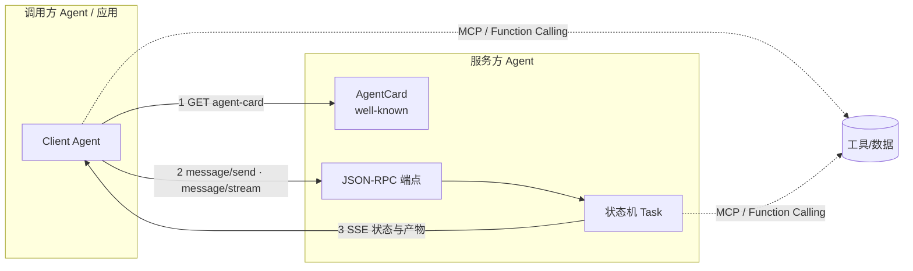

# 什么是A2A协议

## 面试问题

什么是 A2A（Agent2Agent）协议？它解决什么问题？核心对象模型和通信机制是什么？与 MCP、函数调用有什么区别与配合关系？

> **术语说明：** A2A（Agent2Agent Protocol）是 Google 于 2025 年 4 月在 Google Cloud Next 上宣布并开源的一个**开放协议**，代码与规范托管在 `github.com/google/A2A` 与 `google.github.io/A2A`，已有 Salesforce、SAP、Atlassian、MongoDB 等数十家厂商在发布时声明支持。它不是某个产品或 SDK，而是一份跨厂商的互操作规范；本页基于其公开规范的已知内容整理，具体字段以官方规范为准。

## 考察意图

1. **问题动机：** 能否说清楚 A2A 要解决的是**异构 Agent 之间的互操作**——不同框架、不同厂商、不同运行时的 Agent 如何互相发现、理解能力、协作完成任务，而不是再做一个 Agent 框架。
2. **对象模型：** 能否说出 AgentCard、Task、Message、Part、Artifact、TaskStatus/State 这些核心对象及它们的关系。
3. **通信机制：** 能否讲清 JSON-RPC 2.0 方法、HTTP + SSE 的请求/流式模式、推送通知、任务的有状态长生命周期。
4. **协议分层：** 能否把 A2A 与 MCP、Function Calling 放在正确的层次上比较——MCP 是 Agent 接工具/资源的“南向”，A2A 是 Agent 之间的“东西向”，Function Calling 是单 Agent 内部的工具调用机制。
5. **工程判断：** 知道什么时候该用 A2A（跨团队/跨厂商的长任务协作），什么时候不该用（同一进程内的多 Agent 编排用框架内部消息即可）。

## 30 秒回答

1. **结论：** A2A 是一个让异构 AI Agent 之间能**互相发现、对话并协作完成任务**的开放协议，类比 Agent 世界的 HTTP——它不规定 Agent 内部怎么实现，只规定它们之间怎么说话。
2. **主链路：** 客户端通过 `/.well-known/agent-card.json` 拿到对方的 **AgentCard**（名字、能力、端点、认证方式），然后用 **JSON-RPC 2.0 over HTTP** 调用 `message/send` 或 `message/stream` 发送消息，服务端把工作建模为一个有状态的 **Task**，通过 **Message / Part / Artifact** 交换多模态内容，用 **SSE** 把状态更新和产物流式推回。
3. **关键边界：** A2A 与 MCP 不是竞争而是分层——**MCP 连工具，A2A 连 Agent**；Function Calling 是单个 Agent 内部的工具调用，不解决跨 Agent 互操作。A2A 假设对方是不透明的自主实体，因此强调能力发现、长任务、状态协商和人类可读消息，而不是紧耦合的 RPC。



*图：A2A 位于两个 Agent 之间；Agent 内部仍可用 MCP 或 Function Calling 访问工具与数据。协议先做能力发现，再以有状态 Task 交换消息，状态与产物通过 SSE 流式回传。*

## 2 分钟回答

**先讲它要解决的问题。** 在 A2A 之前，把两个不同厂商或框架做的 Agent 接在一起，通常要为每对组合写定制胶水：一方是 LangGraph，另一方是 CrewAI，还有一个是 Salesforce 的 Agentforce，它们各有自己的消息格式、状态模型和调用方式，N 个 Agent 互联就是 O(N²) 的对接成本。A2A 想做的是 Agent 世界的“HTTP + HTML 表单”——给 Agent 一个标准的**自描述方式**（AgentCard）和一套标准的**对话与任务协议**，让任意两个兼容的 Agent 不需要逐对接，就能互相发现能力、发起任务、接收状态和产物。这和当年 REST/OpenAPI 对微服务做的事是同一个思路，只是把“服务”换成了“可能长时间运行、可能多轮对话、可能产出多模态结果”的 Agent。

**然后讲核心对象模型。** A2A 把交互抽象成几个对象。**AgentCard** 是 Agent 的“名片”，通常挂在 `/.well-known/agent-card.json`，包含名字、描述、版本、端点 URL、支持的能力（是否支持流式、是否支持推送通知）、认证方式（如 OIDC、API key）、技能（skill）列表以及输入/输出模态，它让客户端在不读文档的情况下程序化地理解对方能干什么。**Task** 是一次协作的有状态单元，由服务端创建并维护生命周期，状态机大致经过 `submitted → working → input-required → completed / failed / canceled`，每个状态切换都带时间戳和可选消息。**Message** 对应一次发言，有 `role`（user 或 agent）和一组 **Part**；Part 是真正的内容载体，可以是文本、文件、结构化数据（JSON），从而支持多模态和富内容，而不是只传字符串。**Artifact** 是 Task 执行过程中或完成时产生的**产物**（例如生成的报告、图片、代码），同样由 Part 组成，可以被增量更新。

**再讲通信机制。** 传输层默认是 **HTTP + JSON-RPC 2.0**，主要方法包括：`message/send`（发送消息并等待响应，适合短交互）、`message/stream`（建立 SSE 流，持续接收状态更新和 Artifact 更新，适合长任务和流式输出）、`tasks/get`（查询一个已有 Task 的状态）、`tasks/cancel`（请求取消任务）、`tasks/pushNotificationConfig/set|get`（让服务端在任务有更新时通过 webhook 主动回调，而不必让客户端长轮询）。这套设计刻意支持**长任务**：一个 Task 可以跑几秒到几小时，可以中途进入 `input-required` 等客户端补信息，可以产出多个 Artifact，可以被取消，也可以在连接断开后用 `tasks/get` 重新接续——这与传统 RPC 的“一次请求一次响应”很不一样，更接近工作流引擎的任务句柄。认证上，A2A 推荐使用标准的 **OIDC/OAuth 2.0** 令牌，而不是自造签名方案，从而能直接复用企业已有的身份体系。

**最后讲它和 MCP、Function Calling 的分层关系。** 这是面试里最容易被绕进去的点。**Function Calling** 是单个模型/Agent 在一次推理里选择调用某个函数的机制，作用域在一个 Agent 内部，工具 schema 和调用都紧耦合。**MCP（Model Context Protocol）** 是 Anthropic 在 2024 年底提出的开放协议，解决的是 Agent 如何以标准方式接入外部工具、资源和提示模板——它是 Agent 的“南向”协议，把 Agent 连到工具/数据世界。**A2A** 解决的则是 Agent 与 Agent 之间的“东西向”通信，它假设对方是一个**自主、不透明、可能长时间运行**的实体，因此交换的是人类可读的 Message 和有状态 Task，而不是紧耦合的函数签名。三者可以叠加：一个 A2A 服务端 Agent 在处理一个 Task 时，内部完全可以通过 MCP 调数据库、通过 Function Calling 选工具；一个 A2A 客户端 Agent 也可以通过 MCP 把对方 Agent 暴露为一种“远程 Agent 工具”。这个分层——Agent 之间用 A2A，Agent 到工具用 MCP，模型到工具用 Function Calling——是 2025 年 Agent 协议栈正在收敛的形状。

## 原理拆解

### 1. 核心对象模型

| 对象 | 角色 | 关键字段/要点 |
| --- | --- | --- |
| AgentCard | Agent 的能力名片 | name、description、url（JSON-RPC 端点）、version、capabilities（streaming、pushNotifications）、authentication、skills（含输入/输出模态） |
| Task | 一次有状态协作单元 | id、contextId/sessionId、status（含 state 与 timestamp）、history（消息历史）、artifacts |
| TaskStatus / State | 任务状态机 | `submitted`、`working`、`input-required`、`completed`、`failed`、`canceled`；可携带 message |
| Message | 一次发言 | role（`user`/`agent`）、parts、messageId、可选 taskId；可引用原消息 |
| Part | 消息/产物的内容块 | TextPart（文本）、FilePart（base64 或 URI）、DataPart（结构化 JSON）；统一表示多模态 |
| Artifact | Task 产出的结果 | artifactId、name、parts、append/lastChunk 等增量标志；可被多次更新 |

把 **Message（对话过程）** 与 **Artifact（任务产物）** 分开是有意的：二者有不同的更新、追加和引用语义。

### 2. Task 状态机

```text
                 message/send or message/stream
   client  ───────────────────────────────►  submitted
                                               │
                                               ▼
                                            working ◄───┐
                                               │       │ 客户端补充信息
                                  需要更多信息  │       │ (input-required → send)
                                               ▼       │
                                         input-required┘
                                  ┌──────────┼──────────┐
                                  ▼          ▼          ▼
                              completed    failed    canceled
```

- `working` 期间服务端可通过 SSE 持续推送 `StatusUpdate` 和 `ArtifactUpdate`；
- `input-required` 把控制权交还客户端，客户端再发一条 Message 接续同一 Task；
- `completed/failed/canceled` 是终态，但历史与 Artifact 仍可用 `tasks/get` 拉取。

### 3. JSON-RPC 方法

| 方法 | 语义 | 典型场景 |
| --- | --- | --- |
| `message/send` | 发送消息，服务端同步返回响应或 Task 状态 | 短问答、单次指令 |
| `message/stream` | 建立 SSE 流，持续接收状态与产物 | 长任务、流式生成、需要中间进度 |
| `tasks/get` | 按 id 查询 Task 当前状态与历史 | 断线重连、轮询、审计 |
| `tasks/cancel` | 请求取消正在执行的 Task | 用户中止、超时、预算耗尽 |
| `tasks/pushNotificationConfig/set` | 配置 webhook 回调地址与认证 | 不希望常驻 SSE 的长任务 |
| `tasks/pushNotificationConfig/get` | 查询当前推送配置 | 调试与配置管理 |

所有方法遵循 JSON-RPC 2.0 批处理/错误码约定；流式通过 SSE 事件帧下发，每帧是一个 JSON-RPC 响应或事件对象。

### 4. 能力发现与协商

- **发现：** 客户端从 `https://<agent-host>/.well-known/agent-card.json` 获取 AgentCard，类似 OpenID Connect 的 discovery 文档；
- **能力协商：** 客户端根据 `capabilities` 决定走 `message/send` 还是 `message/stream`、是否注册 push notification；
- **技能描述：** 每个 skill 用自然语言描述加输入/输出模态，让客户端 Agent（及其背后的 LLM）能像选工具一样挑选合适的远程 Agent；
- **认证：** AgentCard 中声明所需认证方案，客户端据此附 OIDC token 或 API key，而不是为每个 Agent 单独造鉴权。

### 5. A2A vs MCP vs Function Calling

| 维度 | Function Calling | MCP | A2A |
| --- | --- | --- | --- |
| 作用层 | 模型 → 工具 | Agent → 工具/资源/提示 | Agent ↔ Agent |
| 发起方 | LLM 在一次推理中选择 | Agent（宿主）调用 | 任意 Agent / 应用 |
| 对象粒度 | 函数 + 参数 schema | Tools / Resources / Prompts | Task / Message / Artifact |
| 生命周期 | 一次调用 | 通常短请求/响应 | 有状态长任务、可挂起/恢复 |
| 内容形态 | 结构化 JSON 参数 | 结构化 + 资源 | 多模态 Message/Part + Artifact |
| 对方可见性 | 工具是被动函数 | 工具/资源服务器被动提供 | 对方 Agent 是自主、不透明实体 |
| 传输 | 模型 API 内部约定 | stdio / HTTP+SSE | HTTP + JSON-RPC + SSE |
| 典型类比 | 系统调用 | USB-C / 外设协议 | HTTP / 服务器间协议 |

三者不是替代关系：**Function Calling 让模型会用工具，MCP 让工具可插拔，A2A 让 Agent 可互联**。一个成熟的 Agent 系统往往三者并存。

### 6. 典型协作模式

- **委托（Delegation）：** 主 Agent 把一个子任务整体发给专长 Agent（如“招聘 Agent”→“背景调查 Agent”），等待 Artifact；
- **协商（Negotiation）：** 双方通过多轮 Message 澄清需求，Task 多次进入 `input-required`；
- **流水线（Pipeline）：** 上游 Agent 的 Artifact 作为下游 Agent Message 的 FilePart/DataPart 继续处理；
- **并行扇出：** 客户端同时向多个 A2A Agent 发起 Task，再汇总产物；
- **人工介入（HITL）：** Task 在关键节点进入 `input-required`，由人或另一个审批 Agent 发回决策。

## 递进追问与参考回答

### Q1：为什么不直接用 REST/OpenAPI 把 Agent 包成服务，而要再造一个 A2A？

结论：**REST 描述的是无状态资源，而 Agent 交互天然是有状态、长周期、多模态、可挂起的对话**。OpenAPI 能描述“端点和字段”，但描述不了“这是一个可能跑 10 分钟、中途要问你 3 个问题、产出一份文档和一张图、还能被取消的任务”。A2A 在 JSON-RPC 之上标准化了 Task 状态机、Message/Part 多模态内容、SSE 流式更新和 AgentCard 能力发现，这些都是用裸 REST 要每个团队重新设计一遍的东西。它当然跑在 HTTP 上，但协议语义比 CRUD 更贴近 Agent。

### Q2：AgentCard 里的 skill 描述为什么用自然语言而不是强类型 schema？

结论：因为 A2A 的目标之一是**让 LLM 驱动的客户端能像选工具一样选远程 Agent**，而不只是让程序员写死调用。自然语言加输入/输出模态给了 LLM 足够的选择依据，同时保留了跨厂商演进的灵活性；强类型 JSON Schema 会让双方紧耦合，违背“对方是不透明自主实体”的假设。代价是选择精度不如严格 schema，因此企业内紧耦合场景仍可以用 MCP 或直接 RPC；A2A 更适合松耦合、跨团队/跨组织的协作。

### Q3：SSE 断了怎么办？长任务如何保证不丢状态？

结论：Task 状态由**服务端持久化**，不依赖连接。客户端在 SSE 断开后用 `tasks/get` 按 `taskId` 拉回当前状态和 Artifact；如果不想维持长连接，可以通过 `pushNotificationConfig/set` 注册一个 webhook，让服务端在状态变更时主动回调。SSE 只是传输通道，不是状态本身。生产实现通常还会为 Task 加持久化存储、幂等 taskId、Artifact 分片和断点续传，这些是部署者的责任而不是协议规定。

### Q4：A2A 怎么做安全和多租户？

结论：协议层推荐 **OIDC/OAuth 2.0** 令牌做认证，AgentCard 声明认证方式；鉴权和多租户由服务端实现——根据令牌中的租户/用户标识决定可见的 skill、可访问的 Task、可消耗的配额。传输强制 TLS。由于 Agent 可能代表用户调用其他 Agent，实际部署中通常需要**令牌交换（token exchange）**和**委派审计**，避免一个 Agent 持有过宽权限。协议本身不解决授权策略，它只给你标准的身份携带方式。

### Q5：A2A 和已有的多 Agent 框架（LangGraph、AutoGen、CrewAI）是什么关系？

结论：**框架是实现单元，A2A 是互联总线**。一个 LangGraph 应用内部节点之间走框架自己的消息传递就够了，不需要 A2A；但当它要调用另一个团队用 CrewAI 写的 Agent、或调用 Salesforce/Atlassian 提供的托管 Agent 时，A2A 让两边不必互相定制胶水。框架可以增加“把某个子 Agent 通过 A2A 暴露出去”或“把一个远程 A2A Agent 当作节点接入”的能力。A2A 不抢框架的饭碗，它定义的是框架之间的网线。

### Q6：A2A 消息里为什么要有 Part，而不是直接传字符串或 JSON？

结论：Agent 交互越来越多模态——一段文字里可能要附带一张截图、一份 PDF、一段结构化 JSON 数据。Part 抽象让 Message 和 Artifact 能用统一的有序列表承载 `TextPart`、`FilePart`（base64 或 URI）、`DataPart`（结构化 JSON），既能表达多模态，又能做流式追加（Artifact 可以由多个 chunk 拼出）。只用字符串会迫使双方在外层再编解码文件和数据，只用二进制又丢掉了人类可读的对话上下文。

### Q7：A2A 目前的局限和争议是什么？

结论：首先它**很新**（2025 年 4 月发布），规范和 SDK 仍在快速演进，字段级细节以官方为准；其次，**自然语言 skill 描述**带来的可发现性与可靠性问题尚未解决——LLM 选错 Agent 或误解能力的风险真实存在；第三，**状态一致性、幂等性、长任务持久化**等分布式系统难题协议只给了轮廓，生产级语义要部署者自己补；第四，它和 MCP 的边界在社区仍有讨论（例如“远程 MCP server”和“A2A Agent”在某些场景重叠），最终分层可能还要一两年才稳定。面试时点出这些比把它吹成银弹更可信。

## 常见错误回答

- **“A2A 是 Google 新出的 Agent 框架”**：错。A2A 是开放**协议**，不是框架或 SDK；Google 提供了示例实现，但规范本身与语言、框架无关。
- **“A2A 要取代 MCP”**：错。两者作用层不同——MCP 南向接工具，A2A 东西向接 Agent；设计上是互补，官方也明确表示二者可叠加。
- **“A2A 就是 gRPC/JSON-RPC 调 Agent”**：只说了传输，漏了 AgentCard 能力发现、Task 状态机、多模态 Part、Artifact、SSE 流式和推送通知这些核心语义。
- **“A2A 是同步调用协议”**：错。它原生支持长任务、`input-required` 挂起、SSE 流和 webhook 推送，Task 可以跨连接、跨长时间存活。
- **“用了 A2A 就不用写函数调用了”**：错。Function Calling 仍是单 Agent 内部让模型选择工具的机制；A2A 不替代它，反而通常与之共存。
- **“AgentCard 就是 OpenAPI 换皮”**：部分相似但不同。AgentCard 强调自然语言 skill、能力位（流式/推送）、认证方案和多模态模态，是给 LLM 读的“能力说明书”，而不只是给人读的接口文档。
- **“A2A 只支持 Google 的模型/云”**：错。协议开放，任何 Agent 都可以实现；发布时已有 Salesforce、SAP、Atlassian、MongoDB 等非 Google 厂商支持。

## 评分标准

**不合格（0–2）**

- 没听过 A2A，或把它和某个 Agent 框架混为一谈；
- 只能说出“Agent 之间通信”，讲不出对象模型和通信机制；
- 分不清 A2A 与 MCP / Function Calling 的层次。

**合格（3–4）**

- 能说明 A2A 是异构 Agent 间的开放互操作协议；
- 能说出 AgentCard、Task、Message、Part、Artifact 中至少三个对象及其作用；
- 知道它用 JSON-RPC over HTTP、SSE 做流式，支持长任务和取消；
- 能正确区分 A2A（Agent↔Agent）与 MCP（Agent↔工具）。

**优秀（5–6）**

- 能系统讲清 AgentCard 发现、Task 状态机、JSON-RPC 方法、SSE/推送通知、认证方式；
- 能从协议分层角度比较 Function Calling、MCP、A2A，并说明三者如何叠加；
- 能讨论长任务断线重连、幂等、HITL、多模态 Part、Artifact 增量等工程细节；
- 了解 A2A 的发布背景、参与厂商和当前局限，不把它过度神化；
- 能判断什么时候值得上 A2A（跨组织/跨厂商的松耦合协作），什么时候用框架内部消息就够。

**加分项**

- 提到 AgentCard 的 well-known 发现机制与 OIDC 认证；
- 能对比 REST/OpenAPI、gRPC、消息队列与 A2A 在 Agent 场景下的取舍；
- 了解 A2A 与 MCP 在“远程 Agent vs 远程工具”上的边界讨论；
- 有实际对接或实现 A2A Agent 的经验，能举出状态持久化、推送通知或多模态 Part 的具体坑。

## 关联概念

- [[多智能体系统 Multi-Agent Systems]]
- [[设计一个Coding Agent]]
- [[什么是Loop Engineering]]

> MCP（Model Context Protocol）与 Function Calling 在本库暂无独立页面，故以正文文字讨论；未来建页后可补双链。

## 来源核验

来源：

- Google, *Agent2Agent (A2A) Protocol* 官方规范站, https://google.github.io/A2A/ （核心对象模型、JSON-RPC 方法、AgentCard、Task 状态机的一手规范）
- Google, *A2A Open-source Project*, https://github.com/google/A2A （协议 schema、Python/JS SDK 与示例）
- Google Cloud Blog, *Announcing the Agent2Agent Protocol*（A2A）, 2025-04 （发布背景与支持厂商）
- Anthropic, *Model Context Protocol*, https://modelcontextprotocol.io/ （用于对比 MCP 的作用层与对象模型）

信度：中。A2A 是 Google 2025 年 4 月发布并开源的真实协议，有公开规范站和 GitHub 仓库作为一手来源；但本次写作环境 WebFetch 未获授权，无法逐字段核验，页面中的字段名、方法名和状态值基于公开规范的已知内容整理，**使用时请以 `google.github.io/A2A` 当前规范为准**。MCP 相关对比基于其已稳定的官方文档，可信度较高。若后续 Web 访问可用，建议补充具体章节链接与字段级引用。

## 更新记录

- 2026-08-08: 首次建页；基于 A2A 公开规范的已知内容整理，待 Web 访问恢复后补一手章节引用与字段级核验。
