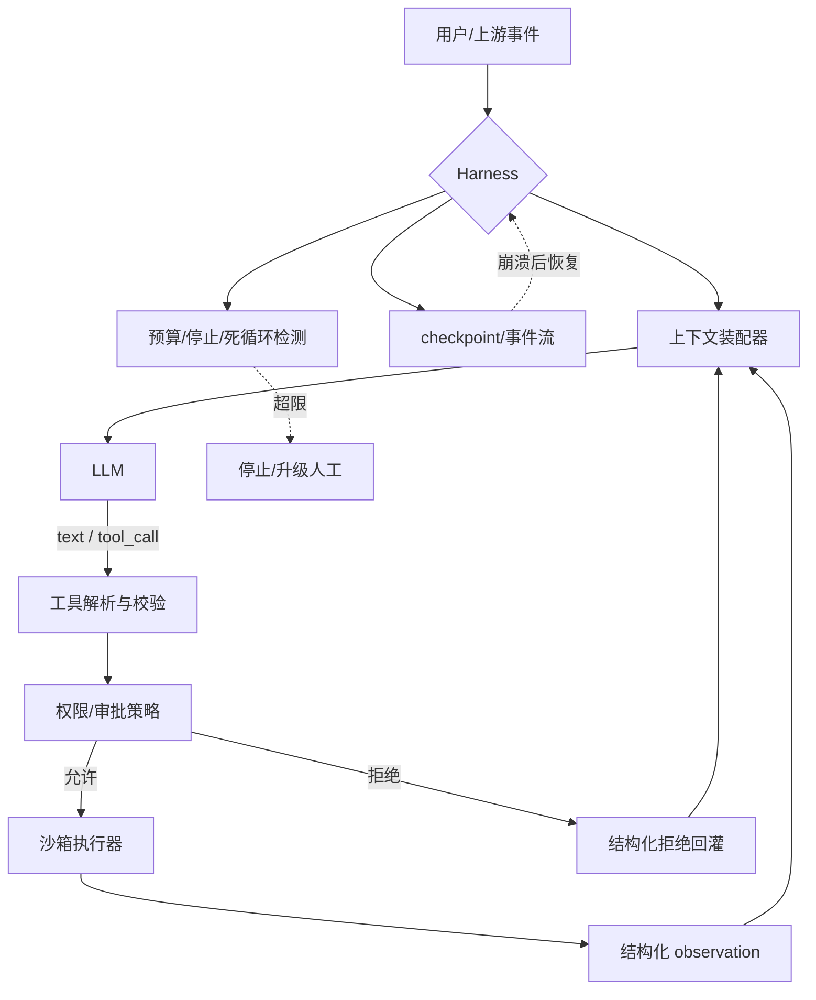

# 什么是Harness工程

## 面试问题

什么是 Agent Harness（智能体运行时脚手架）？一个生产级 LLM agent 的 harness 由哪些部件组成？它和 prompt engineering、framework、agent loop 是什么关系？

> **术语说明：** "Harness"在 LLM agent 语境中指**包在模型外面的那层运行时代码**，并不是有严格学术定义的术语，也和 CI/CD 公司 Harness.io 没有关系。它在 2024–2025 年随着 Claude Code、Devin、OpenHands、SWE-agent 等系统的工程讨论被广泛使用，Anthropic 的 *Building Effective Agents* 把它描述为"LLM 在循环中根据环境反馈使用工具"的那层实现。本页基于可核验的一手工程文章整理这一术语所指的**部件集合与工程职责**，而不是声称某篇来源定义了它。

## 考察意图

1. **概念分层：** 能否区分模型、prompt、framework、harness 四个抽象层——哪些是模型本身的能力，哪些是你写的运行时代码。
2. **部件拆解：** 能否系统列出生产级 harness 的关键件：消息循环、工具注册/调度、上下文装配、权限、沙箱、checkpoint、预算、可观测性。
3. **控制反转：** 是否理解 agent 与传统程序的根本差异——**控制流由模型决定**，harness 负责把这种非确定性约束在可观测、可中止、可恢复的边界内。
4. **工程取舍：** 自写 harness vs 用框架（LangChain/LangGraph/Agent SDK）、单 agent vs 多 agent、同步 vs 流式、本地沙箱 vs 远程沙箱的权衡。
5. **失败模式：** 工具错误未隔离、上下文无限增长、权限过宽、循环无法停止、状态不可恢复——这些真实生产问题。

## 30 秒回答

1. **结论：** Harness 是包在 LLM 外面、让它能"跑起来完成任务"的那层**非模型代码**——消息循环、工具调度、上下文装配、权限、沙箱、checkpoint、预算、观测，全部属于 harness，而不属于模型、prompt 或框架。
2. **主链路：** 一次 harness 迭代大致是 `接收事件 → 装配上下文 → 调模型 → 解析 tool call → 权限校验 → 沙箱执行 → 结构化结果回灌 → 检查停止条件`；模型只在中间一步出现，前后所有步骤都是 harness 的职责。Anthropic 把 agent 定义为"在循环中根据环境反馈使用工具的 LLM"，**实现这条循环就是 harness 工程**。
3. **关键边界：** Harness 解决的是**可控性**问题（能停、能恢复、能审计、能权限隔离），不是**智能性**问题——再聪明的模型配一个坏 harness 也会烧 token、误删文件、死循环。最小可行 harness 就是一个带工具和停止条件的 while 循环，生产级 harness 则是一套运行时。框架可以帮你省掉样板，但**不能替代你对这些部件的设计责任**。



*图：Harness 是模型之外的整条运行时。模型只出现一次，其余每一个框都是 harness 工程师要写、要配、要观测的代码。*

## 2 分钟回答

**先把 harness 放回分层里。** 一个 LLM 应用从上到下大致四层：**模型**（Claude、GPT、Llama，只负责在给定上下文上下一个 token）、**prompt**（system 指令、few-shot、输出格式约束）、**harness**（你写的运行时代码，负责调模型、给工具、管上下文、控权限、做恢复），以及**框架**（LangChain、LangGraph、Claude Agent SDK、OpenAI Agents SDK，这些是 harness 的半成品，不是 harness 本身）。很多人把"用 LangChain 写了个 agent"等同于"做好了 harness"，这是第一个认知偏差——框架省掉的是样板，**工具怎么设计、上下文怎么裁剪、权限怎么放、失败怎么恢复，仍然是你的工程责任**。

**Harness 具体由哪些部件组成，可以按一次迭代的数据流来数。** 第一是**模型客户端**：封装重试、超时、流式、token 记账、模型路由（Haiku/Sonnet/Opus 之间按难度切）。第二是**消息/状态存储**：保存 user/assistant/tool 消息序列，做截断、摘要、外部化（RAG/记忆），支持 checkpoint 和崩溃恢复——Claude Code、OpenHands 这类长任务 agent 必须能从任意一步重放。第三是**工具注册与调度**：每个工具有 JSON Schema、描述、权限标签、超时和重试策略；调度层负责把模型的 tool call 反序列化、校验参数、路由到执行器，并把结果以结构化 observation 回灌。第四是**上下文装配器**：每一轮要决定装哪些消息、哪些检索片段、哪些系统指令、哪些缓存断点，这是 [[AI Agent上下文窗口不足的工程应对]] 的主战场。

**第五是权限与人在回路。** Harness 必须在工具执行前判断：这个动作是否在策略允许范围内？是否需要用户审批？是否高风险（删文件、发邮件、对外付款）？常见实现是按工具/参数打风险等级，低风险自动执行，中风险提示确认，高风险硬阻断或走人工。第六是**沙箱执行器**：bash、文件编辑、浏览器、网络调用都应跑在隔离环境里——容器、虚拟机、 WASM 或显式权限的工作目录——而不是直接在开发者机器上裸跑，尤其当 agent 会执行 LLM 生成的代码时。第七是**停止与预算**：最大步数、最大 token、最大时长、最大花费、连续失败次数、重复动作检测；Anthropic 在 *Building Effective Agents* 里明确建议把 stopping conditions 作为 agent 的一等公民。第八是**可观测性与回放**：每一步的 prompt、response、tool call、耗时、token、退出码都要落事件流，能单步回放、能 diff、能在出 bug 时从任意 checkpoint 复现——这是调试 agent 的唯一靠谱手段。

**Harness 与 agent loop、framework 的关系要讲清。** Agent loop 是一个**设计视角**——观察-思考-行动-反馈怎么串、用 ReAct 还是 CodeAct、停止条件是什么；本库的 [[什么是Loop Engineering]] 专门讲这一层。Harness 是这个 loop 的**具体运行时实现**：loop 决定"要做观察"，harness 决定"用哪个工具执行观察、stdout 怎么截断、错误怎么结构化、超时多少秒"。框架则是 harness 的**预制件**——提供消息抽象、工具装饰器、循环骨架和持久化，但会引入抽象泄漏：Anthropic 在文章里警告框架"会创建额外抽象层，遮蔽底层 prompt 和 response，让调试变难"，建议**先用 LLM API 直接实现，理解每一步在做什么，再决定是否采用框架**。

**工程上的核心张力可以总结为三对取舍。** 第一对是**自主性 vs 可控性**：放权越多，agent 能解决的任务越广，但爆炸半径越大；用权限策略、沙箱、预算、人在回路来约束。第二对是**抽象 vs 透明**：框架加速启动但遮蔽底层，自写 harness 慢但每一步都可见可调试；生产系统通常在原型期用框架，成熟期会把关键路径重新掌握在自己手里。第三对是**状态集中 vs 分散**：把所有东西塞进上下文窗口最简单，但会爆；外置到 RAG、记忆、子 agent、文件系统更可扩展，但要承担一致性和检索召回的代价。最后，*Building Effective Agents* 反复强调一条原则——**最小可行复杂度**：能用单次 LLM 调用解决的不要做 workflow，能用固定 workflow 解决的不要做 autonomous agent；harness 的复杂度必须由任务需求来证明，而不是为了"看起来像 agent"而堆。

## 原理拆解

### 1. Harness、框架、SDK、模型的边界

| 层 | 是什么 | 例子 | 谁负责 |
| --- | --- | --- | --- |
| 模型 | 给定 token 序列输出下一 token | Claude、GPT、Llama | 模型厂商 |
| Prompt | 单次调用的指令、示例、约束 | system prompt、few-shot | 应用开发者 |
| Harness | 把模型包装成可运行 agent 的运行时代码 | 消息循环、工具调度、权限、沙箱、checkpoint | 应用开发者 |
| 框架 / SDK | harness 的半成品库 | LangChain、LangGraph、Claude Agent SDK、OpenAI Agents SDK | 第三方/厂商 |
| 协议 | 工具/上下文的接入标准 | MCP、A2A、OpenAI tool schema | 标准/生态 |

框架可以帮你写 harness，但不能替你做设计决策。**Harness 工程能力恰恰体现在"哪些用框架、哪些自己写、为什么"上。**

### 2. 一次 harness 迭代的标准件

```text
[输入事件]
  用户消息 / 工具回调 / 定时器 / 子 agent 返回
      │
      ▼
[1. 上下文装配]
  system prompt + CLAUDE.md + 历史消息(裁剪/摘要)
  + 检索片段 + 工具结果 + 当前工作目录/计划
      │
      ▼
[2. 调用模型]
  带 tools 定义、temperature、max_tokens、缓存断点
      │
      ▼
[3. 解析输出]
  普通文本 → 直接回用户
  tool_call → 进入工具调度
      │
      ▼
[4. 权限/审批]
  按工具名+参数+当前状态判定 允许/确认/拒绝
      │
      ▼
[5. 沙箱执行]
  超时、资源限制、网络策略、退出码、stdout 截断
      │
      ▼
[6. 结果回灌]
  成功 → 结构化 observation
  失败 → 可恢复错误（带文件名、行号、建议下一步）
  拒绝 → 策略说明
      │
      ▼
[7. 检查停止条件]
  完成 / 步数预算 / token 预算 / 连续失败 / 死循环
      │
      ├── 未停止 → 回到 [1]（可能写入 checkpoint）
      └── 停止   → 返回结果 / 升级人工
```

每一步都有独立的失败模式，都是 harness 工程师要测试和监控的点。

### 3. 八个关键部件清单

| 部件 | 职责 | 常见实现/取舍 |
| --- | --- | --- |
| 模型客户端 | 重试、超时、流式、路由、记账 | 指数退避；按难度/成本路由 Haiku→Sonnet→Opus |
| 消息与状态 | 消息序列、裁剪、摘要、checkpoint | 持久化到 SQLite/对象存储；事件溯源（event sourcing） |
| 工具注册 | schema、描述、权限标签、版本 | JSON Schema + 装饰器；MCP 接入外部工具生态 |
| 工具调度 | 参数校验、路由、并发、超时 | structured outputs 保证参数合法；超时即失败 |
| 上下文装配 | 每轮装什么、缓存哪些 | CLAUDE.md、RAG、记忆检索、prompt cache 断点 |
| 权限与人审 | 风险分级、审批策略 | 按工具/参数黑白名单；危险操作强制确认 |
| 沙箱执行 | 隔离 LLM 生成的代码/命令 | 容器、VM、Firecracker、WASM、受限工作目录 |
| 预算与停止 | 步数、token、时长、花费、死循环 | 硬上限；重复 action 签名检测；连续失败计数 |
| 可观测性 | trace、事件流、回放、指标 | OpenTelemetry、事件日志、单步 replay |

权限和沙箱常被合并，但职责不同：权限决定"允不允许"，沙箱决定"即使搞砸了能造成多大伤害"。

### 4. Harness 设计中的核心模式

来自 *Building Effective Agents* 和生产系统经验：

- **Prompt chaining：** 把任务拆成固定步骤，中间加 programmatic gate——属于 workflow，harness 简单可预测。
- **Routing：** 先分类再分发到专门 prompt/模型；harness 要维护路由表和回退路径。
- **Parallelization：** sectioning（并行独立子任务）/ voting（多次投票）；harness 管并发、聚合、超时。
- **Orchestrator-workers：** 一个 orchestrator LLM 动态拆任务给 worker；harness 要管子 agent 的生命周期、上下文隔离、结果聚合与预算。
- **Evaluator-optimizer：** 一个生成一个评审，循环改进；harness 要管迭代次数和收敛检测。
- **Autonomous agent loop：** 模型自己决定下一步直到完成；harness 复杂度最高，对工具、沙箱、观测、预算要求最严。

**关键判断：** 越往后越灵活，但成本、延迟和失控风险越高。Harness 工程师的品味体现在为任务选最简单够用的模式。

### 5. 多 agent harness 的额外复杂性

Anthropic 的 *Multi-agent Research System* 给出了一手经验：

- **上下文隔离：** 每个子 agent 有独立的消息窗口，主 orchestrator 只看压缩后的结果——这是对抗上下文污染的主要手段。
- **交接（handoff）：** 子 agent 之间通过结构化消息（任务说明、约束、产物引用）交接，而不是共享整个历史。
- **预算与并行：** 主 orchestrator 持有总预算，按子任务分配；并行子 agent 要有独立超时和取消传播。
- **错误隔离：** 一个子 agent 崩溃不应拖垮整个系统；harness 要能局部重试或降级。
- **可观测性的层级：** 单 agent trace 之外，还要看到 orchestrator 的决策、子 agent 的 trace 树和最终产物的来源链。

多 agent 不是银弹，它主要解决两个问题：**上下文窗⼝不够**和**关注点分离**。代价是 token 成本和调试复杂度成倍上升。

### 6. 典型反模式

- **裸 while True：** 没有预算、没有 checkpoint、没有观测，出问题只能 kill。
- **把所有历史塞进 prompt：** 不裁剪、不摘要、不外置，几轮就爆上下文窗口。
- **工具返回原始 stdout：** 未截断、未结构化，模型在几百行日志里找不到关键信息。
- **权限全放开：** 让 agent 直接 `rm -rf`、`git push --force`、访问生产数据库。
- **无沙箱执行 LLM 生成的代码：** 把 prompt injection 升级成 RCE（远程代码执行）。
- **用框架但不理解底层：** LangChain 版本一升级、prompt 被遮蔽、调试无路可走。
- **过早多 agent：** 单 agent 还没跑稳就上 orchestrator-workers，复杂度爆炸而收益不明。
- **把 harness 当 prompt 的延伸：** 试图靠"在 system prompt 里加规则"来解决本应由运行时强制的事（权限、预算、停止条件）。

## 递进追问与参考回答

### Q1：Harness 和 framework（LangChain/LangGraph/Agent SDK）到底什么关系？我能不能不用框架？

能用 LLM API 直接写，而且 Anthropic 明确建议**先这样做**。框架是 harness 的预制件：提供消息抽象、工具装饰器、循环骨架、持久化、可观测性集成。它能省掉 20% 样板代码，但会引入抽象层遮蔽底层 prompt/response，让调试变难，并把你锁在它的概念模型里。成熟团队的常见轨迹是：原型期用框架快速试错，量产后把关键路径（工具调度、上下文装配、权限）自己写，外围（trace、重试、对象存储）继续用库。**用了框架不等于做好了 harness 工程**，就像用了 Web 框架不等于做好了后端架构。

### Q2：Harness 和 Loop Engineering 是一回事吗？

不是同一件事，是**同一头大象的两个截面**。Loop Engineering 是**设计视角**——关注循环结构（ReAct/CodeAct/Plan-Execute）、反馈设计、停止条件、可观测性，回答"这条闭环应该长什么样"。Harness 是**运行时视角**——关注实现这条循环的代码部件：消息怎么存、工具怎么注册、沙箱怎么隔离、checkpoint 怎么写。两者高度重叠但侧重不同：本库的 [[什么是Loop Engineering]] 更偏"为什么这么设计循环"，本页更偏"用哪些工程件把它跑起来"。一个团队可以 loop 设计得很好但 harness 写得很糙（能跑但不可恢复），也可以反过来（harness 很扎实但循环反馈设计糟糕，跑很久不收敛）。

### Q3：为什么"权限"和"沙箱"要分成两个部件？

因为它们防的是不同的故障域。**权限**防的是"agent 在被授权的情况下做了不该做的事"——比如你给了它写文件权限，它去删了它认为"没用"的文件；权限是策略层，决定某个工具调用在当前上下文是否被允许。**沙箱**防的是"工具本身被滥用或有 bug"——比如 agent 跑了一段被 prompt injection 注入的恶意代码，或 `curl | bash` 了不明脚本；沙箱是隔离层，即使动作被允许，破坏范围也被限制在容器/VM 内。两者是纵深防御：权限决定"让不让做"，沙箱决定"做了能炸多大"。生产 agent 两个都要。

### Q4：Checkpoint 到底存什么？怎么存才能恢复？

存**事件流**而不是存最终状态。每个事件类型包括：用户输入、模型请求/响应（含 `tool_call`）、工具调用参数与结果、上下文裁剪/摘要决策、权限审批结论、错误与重试。事件按 `(session_id, step_id)` 顺序追加到 SQLite/Postgres/对象存储，形成 event log。恢复时从最近一个 checkpoint（通常是每 N 步或每个工具边界打一个快照）开始，重放后续事件，重建消息序列和外部世界状态。难点不在存储而在**外部世界可能已经变了**：文件被改、API 返回新数据、会话 token 过期——harness 要么把这些读操作也包成可重放事件，要么在恢复时显式刷新并提示模型"中间发生了什么"。

### Q5：工具结果应该怎么返回给模型？SWE-agent 说的 ACI 是什么？

ACI（Agent-Computer Interface）是 SWE-agent 论文提出的概念：**工具的返回格式本身就是 agent 的用户界面**。好的 observation 应当：退出码/状态明确；错误带文件名、行号、错误类型而不是一大段原始栈；长输出截头尾并告诉模型"省略 N 行，请用 grep/tail 缩小范围"；失败时给出可恢复的下一步建议（不是喂答案，而是提示可以做什么）；编辑类工具返回 diff 而不是整个文件；保持幂等可重放。坏的 observation 会让模型在同一个错误上打转，而好的 ACI 对 SWE-bench 解决率的影响**比换模型还大**——这是 SWE-agent 论文最实用的发现之一。

### Q6：Harness 怎么防 prompt injection 和工具滥用？

四层防御。**输入层：** 把外部内容（网页、文件、工具返回）明确标记为不可信数据，与系统指令隔离；MCP 等协议里有资源/提示的角色区分。**模型层：** 用独立的 LLM 调用做安全分类或用模型自带的 refusal 通道；高风险动作前要求模型显式引用授权来源。**权限层：** 默认最小权限；敏感工具（发邮件、转账、删除、外网访问）要求人审或硬编码白名单；把"读"和"写"工具分开。**沙箱层：** 即使前三层被突破，命令和代码也只能在隔离环境里执行，无外网或仅允许域名白名单，文件系统只挂载工作目录，超时即杀。没有任何单层是完美的，**纵深防御**是唯一靠谱策略。

### Q7：流式输出怎么和工具调用、checkpoint 配合？

两种模式。**消息级流式：** 模型一边吐 token 一边往 UI 推，但 `tool_call` 要等参数完整 JSON 才能执行；harness 在流结束时落一次完整事件。**步骤级流式：** 每个工具执行完立刻把结构化 observation 推给前端，并在那个点打 checkpoint——这种方式更适合长任务，用户能看到"现在在跑测试、现在在改文件"，崩溃也能从最近一个工具边界恢复。生产 harness 通常两者结合：assistant text 走 token 流，`tool call` 走事件流，checkpoint 打在工具边界和停止决策点。要避免把半条 `tool_call` 参数落库——那会让恢复状态不一致。

### Q8：从一个能跑的 demo 到生产级 harness，你会按什么顺序加能力？

按"先保正确，再保可控，最后保可观测"的顺序。第一步是**最小循环 + 工具 + 停止条件**——一个带 `max_steps` 的 while 循环，能跑通黄金路径。第二步是**结构化工具输入输出**——用 JSON Schema/structured outputs 保证参数合法，observation 做截断和错误结构化。第三步是**上下文管理**——加裁剪、摘要、外部检索，防止跑几轮就爆窗口。第四步是**权限与沙箱**——按风险分级，敏感动作人审；命令和代码进容器。第五步是**checkpoint 与恢复**——事件落盘，能从中途重放。第六步是**可观测性**——trace、指标、重放工具，让问题能被定位。第七步才是**多 agent、复杂编排、模型路由**这些进阶能力。反过来做（一开始就上多 agent 框架）几乎一定会翻车。

### Q9：Claude Code、Devin、OpenHands、Cursor 这类产品的 harness 有什么共性？

共性是都把"模型"放在了一个**功能完整但边界严格**的运行时里：都有持久化的会话/事件存储、文件系统访问与 diff 视图、shell/命令执行、代码搜索/导航工具、权限确认、上下文压缩（repo map、滚动摘要）、可中断/可恢复的执行模型。差异在粒度和定位：Claude Code 以 CLI + 文本工具为核心，强调可组合和可脚本化；Cursor/VS Code 类把 harness 嵌进 IDE，共享语言服务和编辑器状态；Devin/OpenHands 更偏自主长任务，有更强的沙箱（VM/Firecracker）、计划工具和浏览器。Anthropic 的多 agent research system 则展示了 orchestrator-workers 形态：主 agent 不直接做事，而是调度带独立上下文的子 agent。**研究这些产品最有价值的不是 UI，而是它们的工具集合、observation 设计和停止策略**——这些才是 harness 工程的精华。

## 常见错误回答

- **"Harness 就是 while 循环调 LLM"**：只说了外壳，没说工具、权限、沙箱、checkpoint、预算、观测——这些才是决定能不能上生产的部分。
- **"用 LangChain/LangGraph 就行了，不用自己写 harness"**：框架是预制件不是设计；不理解底层部件，出问题无路可调试。
- **"Harness 是 Anthropic/Claude 特有的概念"**：术语确实在 Claude Code 社区流行，但 Devin、OpenHands、SWE-agent、AutoGen 等都有自己的 harness，只是叫法不同（agent runtime、scaffold、orchestrator）。
- **"Harness engineering 就是 prompt engineering 的新名字"**：prompt 是单次指令，harness 是模型之外的整个运行时，二者抽象层不同。
- **"Agent 越自主越好"**：自主性要和任务可信度、权限边界、监控能力匹配；*Building Effective Agents* 明确建议从最小可行复杂度开始。
- **"权限靠 system prompt 约束就够了"**：prompt 不是安全边界，工具必须在运行时做权限校验和沙箱隔离。
- **"把所有历史都放上下文最省事"**：几轮内就爆窗口；必须裁剪、摘要、外部化。
- **"多 agent 一定比单 agent 强"**：多 agent 解决上下文隔离和关注点分离，但成本和调试复杂度成倍上升，单 agent 没跑稳时上多 agent 通常是反模式。
- **"Checkpoint 就是把 messages 数组存一下"**：外部世界状态（文件、API、缓存）也需要可重建或显式刷新，否则恢复后状态不一致。

## 评分标准

**不合格（0–2）**

- 把 harness 等同于 prompt、framework 或一个简单的 while 循环；
- 列不出工具、权限、沙箱、checkpoint 中至少两个部件；
- 不知道 agent 与传统程序在控制流上的区别。

**合格（3–4）**

- 能说清 harness 是模型之外的运行时层，区别于 prompt 和 framework；
- 能列出至少四个核心部件（消息循环、工具调度、上下文装配、权限、沙箱、checkpoint、预算、观测）；
- 知道 *Building Effective Agents* 里 workflow vs agent 的区分和最小可行复杂度原则；
- 能解释至少一个生产反模式（裸循环、权限全放开、上下文无限增长等）。

**优秀（5–6）**

- 能系统讲清八个部件的职责、实现选项和失败模式；
- 能区分 harness 与 loop engineering、framework、protocol（MCP/A2A）的边界；
- 能引用 SWE-agent ACI、Anthropic 多 agent 系统等一手来源说明观察设计、上下文隔离和子 agent 交接；
- 能讨论权限 vs 沙箱、流式 vs checkpoint、自写 vs 框架、单 agent vs 多 agent 的工程取舍；
- 有从 demo 到生产的 harness 演进路径，知道按什么顺序加能力。

**加分项**

- 实际写过或读过 Claude Code/OpenHANDS/SWE-agent 这类系统的 harness 代码；
- 能讨论事件溯源、prompt cache 断点、MCP 工具生态、Firecracker/VM 沙箱等具体实现；
- 对 prompt injection 的纵深防御有实操经验；
- 能讲清 harness 中的可观测性如何和 LLMOps/trace 系统集成。

## 关联概念

- [[什么是Loop Engineering]]
- [[设计一个Coding Agent]]
- [[ReAct Agent 工作原理]]
- [[AI Agent上下文窗口不足的工程应对]]
- [[如何让LLM稳定输出JSON]]
- [[提示工程 Prompt Engineering]]
- [[什么是A2A协议]]

## 来源核验

来源：

- Anthropic, *Building Effective Agents*, 2024-12-19, https://www.anthropic.com/engineering/building-effective-agents （workflow vs agent 定义、prompt chaining/routing/parallelization/orchestrator-workers/evaluator-optimizer 模式、stopping conditions、sandbox、对框架抽象层的警告、最小可行复杂度——本页核心一手来源）
- Anthropic, *How we built our multi-agent research system*, 2025, https://www.anthropic.com/engineering/multi-agent-research-system （多 agent harness 中的上下文隔离、handoff、预算与错误隔离的一手工程经验）
- Yang et al., *SWE-agent: Agent-Computer Interfaces Enable Automated Software Engineering*, 2024, https://arxiv.org/abs/2405.15793 （ACI/observation 设计对 agent 表现影响的一手论文）
- Anthropic, *Model Context Protocol*, https://modelcontextprotocol.io/ （工具/资源/提示接入 harness 的开放协议）

信度：中。Anthropic 两篇工程文章和 SWE-agent 论文均为可核验的一手高信度来源，MCP 为官方规范；但 **"harness" 作为术语本身没有在这些来源中被给出唯一定义**，它是社区对"模型之外的运行时"这一工程层的归纳命名，Claude Code 相关讨论中常见使用但缺乏标准化文本。因此本页 confidence 标为"中"：底层部件与工程原则可核验，术语归属不可核验。此外，本会话已直接抓取 *Building Effective Agents* 原文确认其中关于 workflow/agent、stopping conditions、sandbox 与框架的表述；其他来源基于对其公开内容的既有知识，部署前建议按当前文档核对。

## 更新记录

- 2026-08-11: 首次建页；整理 harness 的八个部件、与 prompt/framework/loop engineering 的分层、核心模式与多 agent harness 的额外复杂性；术语本身尚在形成中，待有更权威定义后更新。
