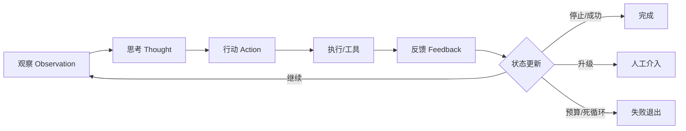

# 什么是Loop Engineering

## 面试问题

什么是 Loop Engineering？它和 Prompt Engineering、Context Engineering 有什么区别？在 Agent 系统里它具体工程化哪些东西？

> **术语说明：** "Loop Engineering"目前不是有严格学术定义的专有名词，没有一篇论文或官方文档把它作为标准术语提出。它是 2024–2025 年随着 Agent 系统复杂化，社区和工程实践中逐渐使用的说法，用来描述"对 agent 闭环本身的工程化"。本页基于可核验的一手文献（ReAct、SWE-agent、MemGPT、Generative Agents、Anthropic 工程博客）整理该术语所指的工程实践，而不是声称某篇来源定义了它。

## 考察意图

1. **术语辨析：** 能否区分 Prompt Engineering（单次提示设计）、Context Engineering（每轮输入装配）和 Loop Engineering（闭环设计）三个抽象层。
2. **闭环要素：** 能否说出一个 Agent 循环的关键工程件：观察、思考、行动、反馈、状态、停止条件、人工介入点。
3. **收敛与失控：** 是否理解 agent 循环不是"跑越多越好"，而是要设计反馈信号、步数预算、死循环检测和升级路径。
4. **可观测性：** 能否把循环当作可调试、可评估、可回放的工程对象，而不是一个黑盒 prompt。
5. **实践判断：** 知道什么场景值得重工程化循环（自主 coding agent、长任务 agent），什么场景不需要（单轮 RAG、简单分类）。

## 30 秒回答

1. **结论：** Loop Engineering 是把 Agent 的**观察—思考—行动—反馈闭环**本身当作工程对象来设计和优化，而不是只优化某一次的 prompt 或某一轮的上下文。
2. **主链路：** 它关注五件事——循环结构（ReAct/CodeAct/Plan-Execute）、工具与观察接口（ACI）、跨轮状态与上下文（记忆、压缩、分页）、停止与升级条件（步数预算、死循环检测、人工审批）、以及循环的可观测性与评估（事件流、回放、成功率）。
3. **关键边界：** 它和 Prompt/Context Engineering 是不同层：prompt 是一句话怎么写，context 是这一轮给模型看什么，loop 是**模型在多轮里如何推进、收敛、失败、求助**。过度工程化循环会把简单任务做重；不工程化则会在长任务里遇到死循环、上下文爆炸和无法调试的问题。



*图：Loop Engineering 工程化的不是某一次 LLM 调用，而是这条闭环本身——结构、状态、反馈、停止、升级、观测。*

## 2 分钟回答

**先承认术语现状。** "Loop Engineering"不是像"Chain-of-Thought"或"RAG"那样有标准论文定义的术语，它在 2024–2025 年的 Agent 工程讨论中被使用，用来命名一个真实存在的工程层：当你的系统从"一次提示词调用"变成"LLM 连续做几十步、调十几个工具、跨小时运行"时，你需要工程化的东西已经不只是 prompt 或 context，而是整个闭环。这个术语尚在形成，面试时最好把它讲成一个**工程视角**而不是背诵某个定义。

**它和 Prompt/Context Engineering 的分层关系可以这样讲。** 最内层是 **Prompt Engineering**：怎么写这一次指令、few-shot 示例怎么放、输出格式怎么约束；它作用在一次调用内。中间层是 **Context Engineering**：每一轮要把哪些记忆、检索片段、工具结果、历史消息放进这个上下文窗口；它作用在一次调用的输入上。最外层是 **Loop Engineering**：模型在多轮之间怎么走完一个任务——用什么循环结构（ReAct 交错推理与行动、CodeAct 用代码当动作、Plan-and-Execute 先规划再执行）、工具反馈如何设计、上下文如何跨轮压缩与换页、什么时候停下来认为完成、什么时候升级给人或更强的模型、怎么检测和打断死循环。三层不是替代关系而是嵌套关系：好的 loop 工程不能救一个糟糕的 prompt，但糟糕的 loop 设计会让再好的 prompt 和 context 也跑不完长任务。

**它具体工程化哪些东西，可以对照 ReAct/SWE-agent/MemGPT 三个一手来源讲。** ReAct 给出了循环的基本骨架——thought-action-observation 交替进行，并把推理和行动绑定在同一个 token 序列里；SWE-agent 证明了**工具接口（ACI）设计**比换模型更影响循环收敛性——窄命令、结构化反馈、可恢复错误让循环不容易走偏；MemGPT 引入了**循环内的内存管理**——让模型自己通过函数调用在主上下文和外部存储之间换页，类比 OS 虚拟内存，这是把"循环中的状态管理"显式工程化；Generative Agents 加入了**反思与时间衰减**，让循环里的记忆不是 append-only，而是会被总结、遗忘、强化。

**工程上的关键件主要有六类。** 一是**循环骨架与策略**：根据任务选择 ReAct、CodeAct、Plan-Execute、Reflexion 或其组合；二是**工具-观察接口**：每个工具返回结构化反馈（退出码、截断后的输出、错误定位），失败时给出可恢复的下一步建议；三是**跨轮状态与上下文**：事件流持久化、滚动摘要、仓库地图/记忆检索、当前 diff 或工作计划；四是**停止与升级条件**：最大步数/token/时长预算、目标达成检测、重复行动检测、连续失败计数、危险操作人工审批；五是**可观测性与回放**：把每一步 thought/action/observation 记录为可查询事件流，支持单步回放和 diff，这是调试循环的基础；六是**评估**：不只评估最终答案，还要评估轮数、成本、重试率、人工介入率、死循环率等过程指标。

**最后要知道它的边界。** 不是所有 LLM 应用都需要 loop engineering。单轮问答、简单分类、一次成型的文案生成用不到闭环。重工程化循环会引入延迟、成本和调试复杂度。判断标准是：**任务是否需要模型根据外部反馈调整下一步、是否跨多轮、是否有状态累积**——三个都"是"才值得把循环当作正经工程对象。即便如此，Anthropic 的 Building Effective Agents 提醒：能靠单次调用加检索解决的，就不要上多步 agent；**最小可行复杂度**优先。

## 原理拆解

### 1. 三个"Engineering"的分层

| 层 | 作用对象 | 核心问题 | 典型产物 | 代表来源 |
| --- | --- | --- | --- | --- |
| Prompt Engineering | 一次 LLM 调用的指令 | 怎么问、怎么示范、怎么约束输出 | system prompt、few-shot、CoT | 提示工程文献 |
| Context Engineering | 一次调用的输入装配 | 这一轮放哪些数据、记忆、工具结果 | RAG 检索、上下文压缩、prompt cache | 2024–2025 Agent 实践 |
| Loop Engineering | 多轮闭环本身 | 怎么推进、怎么收敛、何时停、何时升级 | ReAct/CodeAct 循环、ACI、事件流、预算/审批 | ReAct、SWE-agent、MemGPT |

三层嵌套：loop 决定每一轮调用哪个 prompt、装什么 context；context 决定 prompt 能看到什么；prompt 决定单轮输出质量。任一层糟糕都会拖垮整体，但优化它们的手段和度量不同。

### 2. 一个标准 Agent 循环的组成

```text
[初始化]
  加载任务、系统提示、工具集、记忆
[循环每一步]
  1. 观察：收集上一步 action 的 observation、更新事件流
  2. 组装上下文：repo map / 记忆检索 / 历史摘要 / 当前计划
  3. 思考：LLM 产生 thought（可选）
  4. 行动：LLM 选择 tool call 或代码动作
  5. 执行：沙箱中运行，捕获 stdout/stderr/退出码/diff
  6. 反馈：结构化结果返回上下文
  7. 检查：停止条件、预算、死循环、危险操作
[结束]
  成功提交 / 失败退出 / 升级人工
```

每一步都有可工程化的决策点，而不是"让 LLM 自由发挥"。

### 3. 循环结构的几种主流范式

| 范式 | 动作表示 | 特点 | 典型场景 |
| --- | --- | --- | --- |
| ReAct | thought + 文本工具调用 | 推理与行动交错，可读、可审计 | 通用 agent、问答+工具 |
| CodeAct | 可执行 Python/bash 代码 | 表达力强、轮数少，沙箱要求高 | 数据处理、批量操作、coding agent |
| Plan-and-Execute | 先出完整计划再执行 | 可先做任务拆解和人类确认 | 长任务、多步工作流 |
| Reflexion | 执行后语言反思并再试 | 用自我反思改进下一轮尝试 | 复杂推理、有明确成败信号 |
| Tree-of-Thought / 多路径 | 并行多条思路再选择 | 探索性强、成本高 | 难题求解、方案搜索 |
| MemGPT 分页式 | 模型通过函数调用自管内存 | 长任务跨小时运行 | 长期对话、深度研究 |

工程上很少纯用一种，通常是 Plan-and-Execute 做骨架 + ReAct/CodeAct 执行子任务 + Reflexion 在失败点重试。

### 4. 反馈设计是循环收敛的关键

一个循环能不能收敛，很大程度取决于**工具返不返得好**：

- **退出码和状态**：成功/失败/部分成功要清晰；
- **错误定位**：编译/测试错误要带文件名、行号、错误类型，而不是原始日志一大段；
- **输出截断**：长输出截头尾并给出"省略 N 行，请用 grep/tail 缩小范围"的引导；
- **下一步建议**：错误信息中带可操作的下一步（不是把答案喂给模型，而是提示它可以做什么）；
- **幂等性与可恢复**：失败后重跑不应产生副作用，编辑类工具要能回滚。

SWE-agent 的 ACI 论文是这一层最系统的经验来源。

### 5. 状态、上下文与记忆的跨轮管理

| 状态类型 | 存什么 | 生命周期 | 工程手段 |
| --- | --- | --- | --- |
| 工作状态 | 当前计划、最近 N 步、打开的文件/页面 | 单任务 | 上下文窗口 + scratchpad |
| 事件流 | 所有 thought/action/observation | 整个会话 | 持久化日志，可回放 |
| 长期记忆 | 用户偏好、历史经验、实体知识 | 跨会话 | 向量库 + KG + 反思（MemGPT、Generative Agents） |
| 外部世界状态 | 仓库、数据库、第三方 API | 任务外部 | 工具调用时读/写，不常驻上下文 |

跨轮上下文必须做**压缩和分页**：旧 observation 摘要、长输出外置、当前 diff 或计划常驻。不要把整个事件流无限堆进 prompt。

### 6. 停止、升级与死循环

- **硬停止**：达到最大步数、token、时长预算；触发危险操作策略；
- **成功停止**：模型调用 `submit` 且校验通过（测试全绿、lint 通过、目标达成）；
- **升级**：连续失败 K 次、置信度低、检测到自己在打转、遇到需人类判断的决策（删数据、授权、歧义需求）；
- **死循环检测**：对最近 N 步 action 做规范化签名比对，重复或近似重复触发提示或打断；
- **预算反馈给模型**：让模型知道"还剩 X 步、$Y 预算"，促使它收敛。

### 7. 可观测性与评估

Loop Engineering 的一个核心态度是：**把循环当成可以调试和评估的系统，而不是黑盒**。

- **事件流（event stream）**：OpenHands 的设计——每一步都是结构化事件，可序列化、可回放、可重放；
- **Trace**：每一步的 prompt、response、tool call、耗时、token、成本；
- **单步回放与 diff**：从任意一步恢复状态并重跑，用于回归测试；
- **过程指标**：平均步数、每任务成本、成功率、死循环率、人工介入率、工具调用分布；
- **结果指标**：任务成功率、PR 合并率、回滚率；
- **对抗性回放**：把曾经失败的 case 固化为回归集。

## 递进追问与参考回答

### Q1：Loop Engineering 和 Agent 框架（LangChain、AutoGen、OpenHands）是什么关系？

框架是 Loop Engineering 思想的一种载体，但不等于它。框架提供循环骨架、工具注册、事件流、内存抽象等基础设施；Loop Engineering 是你在这些框架之上或之外做的设计决策——选什么循环结构、工具反馈怎么设计、停止条件怎么设、怎么做评估。用了框架不等于做好了 loop engineering，就像用了 Web 框架不等于做好了后端架构。反过来，理解 loop engineering 能让你判断某个框架的默认循环是否适合你的任务，而不是被框架的抽象绑住。

### Q2：怎么判断我的应用需不需要 Loop Engineering？

三个判断条件：**是否需要根据外部反馈改变下一步**（不只是单次生成）、**是否跨多轮并有状态累积**、**任务时长和复杂度是否足以让单轮 prompt 失效**。三者皆"是"才值得把闭环作为工程对象。单轮分类、摘要、改写、一次成型的 RAG 问答都不需要。经验法则：如果你的 agent 步数通常 ≤ 2 且没有工具调用，它就不是真正的 agent，也用不到 loop engineering。

### Q3：为什么说"工具反馈"是循环工程里最被低估的一环？

因为模型在循环里的下一步几乎完全由上一步 observation 决定。同样的模型和 prompt，工具返回"error"还是返回"在文件 X 第 Y 行出现类型错误，建议检查变量 Z 的赋值"，会导致收敛步数差几倍。SWE-agent 论文的核心发现就是 ACI 设计对 SWE-bench 解决率的影响大于换模型。好的反馈让错误可恢复、让下一步空间收窄；坏的反馈让模型在同一个错误上打转或胡乱尝试。

### Q4：怎么打断一个已经陷入死循环的 agent？

三层。**检测层**：对最近 N 步 action 做规范化（去掉时间戳、归一化参数）并比对签名；检测到重复或近重复时显式告诉模型"你在第 K 步试过这个，结果是 X，请换思路"。**预算层**：硬上限（步数、token、时长、连续失败次数），到点强制停。**策略层**：触发反思或升级——让模型做一次元反思（"总结你已知什么、未知什么、下一步计划"），或者切到更强的模型/路由给人。不要只依赖模型自己知道什么时候该停。

### Q5：Loop Engineering 和 MLOps / LLMOps 是什么关系？

有重叠但关注点不同。LLMOps 关注模型的部署、监控、评估、数据飞轮，覆盖从训练到上线的全生命周期；Loop Engineering 聚焦在**运行时的 agent 闭环设计**——循环结构、工具、状态、停止条件。两者交集在**可观测性与评估**：LLMOps 提供 trace、指标、告警、A/B 框架，Loop Engineering 利用这些设施度量循环质量。可以把 Loop Engineering 看作 LLMOps 在 agent 运行时这个子领域的延伸。

### Q6：上下文压缩、记忆、RAG 算 Loop Engineering 还是 Context Engineering？

它们横跨两层。**决定这一轮放什么**（检索哪些片段、注入哪段记忆、用哪个缓存断点）是 Context Engineering；**决定这些信息如何在循环中跨轮演变、何时压缩、何时换页、何时写回长期记忆**是 Loop Engineering。例如滚动摘要的触发时机、保留窗口大小、摘要指针如何回查原文，属于 loop 层；摘要具体怎么拼进这一轮 prompt，属于 context 层。实际工程中两者一起设计，但分清楚有助于定位问题。

### Q7：有没有"过度 Loop Engineering"的反模式？

有。典型反模式包括：为只需要单轮 RAG 的场景上 Plan-and-Execute + 多 agent + 反思，导致延迟和成本爆炸；循环里加太多自我反思步骤，让 agent 在 meta-reasoning 里空转；工具粒度过细，本来一个函数调用能完成的动作拆成十几个 ACI 命令，人为拉长轨迹；为每一种失败路径都写专门的分支，把 LLM 系统写成脆弱的规则引擎。Anthropic 的建议是从**最小可行 agent**开始——最简单的循环加最少的工具，能跑通再加反思、规划、多 agent 等复杂度。

## 常见错误回答

- **"Loop Engineering 就是写一个 while 循环调 LLM"**：只说了外壳，没说反馈、状态、停止条件和可观测性这些真正决定成败的部分。
- **"它是某某论文新提出的范式"**：目前没有一篇权威论文定义该术语，把它说成标准术语或挂靠到某篇特定论文都是不准确的。
- **"Loop Engineering 会取代 Prompt/Context Engineering"**：三者是嵌套层级，不是替代关系；循环里每一步仍需要写 prompt、装 context。
- **"Agent 跑的步数越多越智能"**：步数多往往意味着反馈不好或路径不收敛，应作为成本/失败信号而非能力信号。
- **"让模型自己决定什么时候停就行"**：没有硬预算和死循环检测，agent 可能烧光预算或陷入循环，生产系统必须有外部守卫。
- **"加反思/多 agent 就能提升"**：这些都是复杂度，必须有评测证明它们带来净收益，否则只会增加延迟和成本。
- **"事件流记个 log 就行"**：log 是给人看的，事件流要支持结构化查询、单步回放和状态重建，是调试循环的基础设施。
- **"工具直接返回原始 stdout 最透明"**：未截断、未结构化的原始输出会迅速淹没上下文并误导模型，结构化反馈是 ACI 的核心价值。

## 评分标准

**不合格（0–2）**

- 说不出 Loop Engineering 指什么，或把它等同于"写循环"；
- 无法区分它和 Prompt/Context Engineering；
- 不知道停止条件、死循环、反馈设计等基本问题。

**合格（3–4）**

- 能说明 Loop Engineering 是对 agent 观察-思考-行动-反馈闭环的工程化；
- 能区分三个 Engineering 的作用层；
- 能列举至少四个循环工程件（结构、ACI、状态、停止、可观测性、评估）；
- 知道 ReAct 等典型循环范式。

**优秀（5–6）**

- 能引用 ReAct、SWE-agent、MemGPT、Generative Agents 等一手来源说明各工程件的依据；
- 能系统讨论反馈设计、跨轮状态管理、停止/升级条件和死循环检测；
- 能把可观测性、事件流、过程指标作为 loop engineering 的一等公民；
- 能判断任务是否需要重工程化循环，并知道最小可行复杂度原则；
- 清楚该术语尚未标准化，不把它包装成某个作者的定义。

**加分项**

- 提到 CodeAct、Plan-and-Execute、Reflexion、Tree-of-Thought 等范式的取舍；
- 能讨论上下文压缩、记忆分页在 loop 层和 context 层的不同职责；
- 有实际构建/调试过长任务 agent 的经验，能举出死循环、反馈不良、状态污染的真实案例；
- 了解 OpenHands 事件流、SWE-agent ACI、Letta/MemGPT 内存管理等具体系统设计。

## 关联概念

- [[ReAct Agent 工作原理]]
- [[Agent 记忆架构]]
- [[设计一个AI Agent的记忆系统]]
- [[设计一个Coding Agent]]
- [[AI Agent上下文窗口不足的工程应对]]
- [[多智能体系统 Multi-Agent Systems]]
- [[思维链 Chain-of-Thought]]
- [[可观测性 Observability]]

## 来源核验

来源：

- Yao et al., *ReAct: Synergizing Reasoning and Acting in Language Models*, ICLR 2023, https://arxiv.org/abs/2210.03629 （thought-action-observation 循环范式的一手来源）
- Yang et al., *SWE-agent: Agent-Computer Interfaces Enable Automated Software Engineering*, 2024, https://arxiv.org/abs/2405.15793 （工具/观察接口设计对循环收敛性影响的一手来源）
- Park et al., *Generative Agents: Interactive Simulacra of Human Behavior*, UIST 2023, https://arxiv.org/abs/2305.10601 （记忆流、反思、时间衰减等跨轮状态管理的一手来源）
- Packer et al., *MemGPT: Towards LLMs as Operating Systems*, 2023, https://arxiv.org/abs/2310.08560 （循环中由模型自主分页管理上下文的一手来源）
- Anthropic, *Building Effective Agents*, 2024, https://www.anthropic.com/engineering/building-effective-agents （最小可行 agent、循环与工作流模式的工程实践）

信度：中。上述来源本身都是高信度的一手论文/官方工程文章，分别支撑了 ReAct 循环、ACI、记忆、分页、最小可行复杂度等具体机制；但 **"Loop Engineering" 作为术语本身没有在这些来源中被定义**，它是社区对这一层工程实践的归纳命名。因此本页 confidence 标为"中"：底层机制可核验，术语归属不可核验。

## 更新记录

- 2026-08-02: 首次建页；术语尚在形成中，底层机制基于可核验一手来源整理，待术语归属有明确定义后更新。
