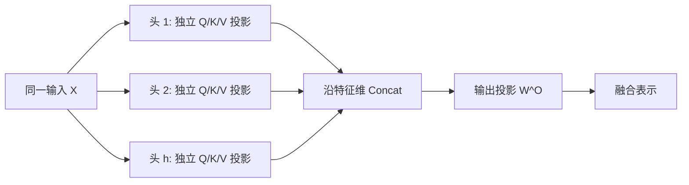

# 多头注意力机制的核心作用是什么

## 面试问题

多头注意力机制的核心作用到底是什么？

## 考察意图

1. **概念辨析：** “多头”切分的是投影后的特征维，不是把 token 序列切成多段。
2. **核心机制：** 说明多组独立 $Q/K/V$ 投影、并行注意力、特征拼接和 $W^O$ 输出投影。
3. **复杂度判断：** 解释固定 $d_{\text{model}}$ 时，每头维度缩小使主要计算量与同维单头大致同阶。
4. **解释边界：** 不同头可以学习不同模式，但不保证稳定专门化，也不能把注意力权重直接当成因果解释。

## 30 秒回答

1. **结论：** 多头注意力用多组可学习投影，让同一批 token 在多个表示子空间中并行形成不同注意力模式。
2. **机制：** 每头独立计算 $Q/K/V$ 注意力，各头输出沿特征维拼接，再经 $W^O$ 融合回 $d_{\text{model}}$。
3. **边界：** 固定总维度时主要计算量与同维单头大致同阶；多头提供多样模式的机会，但不保证每个头稳定、专一或可作因果解释。

*图：所有头读取同一允许序列，差异来自独立的特征投影；拼接后仍需 $W^O$ 完成可学习融合。*

## 2 分钟回答

**先看每个头。** 输入为 $X \in \mathbb{R}^{n \times d_{\text{model}}}$ 时，第 $i$ 个头用自己的 $W_i^Q$、$W_i^K$、$W_i^V$ 把同一个 $X$ 投影到较低维子空间，再做缩放点积注意力。独立参数允许各头形成不同的相似度几何和 token 加权模式。

第 $i$ 个头可写为

$$
\operatorname{head}_i = \operatorname{softmax}\!\left(\frac{XW_i^Q(XW_i^K)^\top}{\sqrt{d_k}}\right)XW_i^V.
$$

**再融合各头。** 模型将 $h$ 个头沿特征维拼接，再用 $W^O$ 做线性变换：

$$
\operatorname{MHA}(X)=\operatorname{Concat}(\operatorname{head}_1,\ldots,\operatorname{head}_h)W^O.
$$

**复杂度取决于总维度。** $W^O$ 不只恢复形状，还学习如何混合不同头的信息。在原始 Transformer 的常见设置中，$d_k=d_v=d_{\text{model}}/h$，所有头的 $QK^\top$ 总成本约为 $h n^2 d_k=n^2d_{\text{model}}$，所有头与 $V$ 相乘的总成本也同阶。固定 $d_{\text{model}}$ 时，多头主要重分配表示容量，不是把完整维度的注意力重复计算 $h$ 次。

**能力不等于解释。** 分析工作观察到过关注位置、句法或指代的头，但头之间也存在冗余；“可以学到多种模式”不等于“每个头必然专门化”，注意力权重也不等于模型决策的因果解释。

## 原理拆解

1. **多个可学习的表示子空间**：头的差异来自独立投影矩阵，而不是预先人工指定“这个头看语法”。训练目标通过反向传播决定这些子空间如何组织。
2. **多种注意力模式**：每个头都对完整的允许序列位置计算权重；多头切分的是投影后的特征维，不是将 token 序列切成几段。
3. **拼接与输出投影**：拼接保留每个头的输出通道，$W^O$ 再将它们映射回 $d_{\text{model}}$，并允许头间信息发生可学习的线性混合。
4. **固定模型维度下的成本**：当 $d_k=d_v=d_{\text{model}}/h$ 时，总投影参数量约为 $4d_{\text{model}}^2$，与同维单头的主要参数量一致；注意力矩阵的总主要计算也是 $O(n^2d_{\text{model}})$。真实运行时仍会受 kernel、并行度、内存访问和头维度影响，不能将渐进复杂度等同于墙钟时间完全相同。
5. **能力不等于解释**：多头提供学习多样模式的机会，但不保证所有头都不同、有用、稳定或人类可解释。某些头可被剪枝而性能变化很小，就是冗余存在的证据之一。

## 递进追问与参考回答

### 追问 1：为什么不直接用一个 $d_{\text{model}}$ 维的大头？

单头只生成一组基于同一投影几何的注意力权重。多头用多组独立投影和 softmax 分布提供多条并行通路，能同时保留不同关系的信号。这是表示偏置的差异，不是对单头一定无法表示同类函数的形式化证明。

### 追问 2：头数增加，效果是否一定更好？

不一定。在 $d_{\text{model}}$ 固定时，头数增加会降低每头维度，可能损害单头表示能力；太多头还可能冗余。头数是模型维度、硬件效率和任务效果之间的超参数权衡，需要用消融实验验证。

### 追问 3：能否把注意力头画出来，就说明模型为什么做出决策？

不能直接得出这个结论。注意力图可以描述某层某头的软对齐，但输出还经过值向量、输出投影、残差连接和后续层。如果要声称因果影响，至少需要头消融、激活替换或其他干预实验。

### 追问 4：多头为什么没有把注意力的 $O(n^2)$ 复杂度变成 $O(hn^2)$ 的额外倍增？

如果只写头数会看到 $h$ 个矩阵，但每个矩阵乘法的特征维是 $d_k=d_{\text{model}}/h$。因此总成本是 $h\cdot O(n^2d_k)=O(n^2d_{\text{model}})$。若实现中让每头都保留完整 $d_{\text{model}}$ 维，那就不再是这个固定总维度的比较。

## 常见错误回答

- **“每个头都会自动学到一个明确语言学职责。”** 不准确。专门化只是可能观察到的现象，不是结构保证；头可以冗余、分布式编码或随层和样本变化。
- **“多头是把句子切成多段各自处理。”** 错在混淆了序列维和特征维。标准多头的每个头都能关注完整的允许序列。
- **“八个头就是八倍参数和八倍计算。”** 忽略了每头维度通常缩小为总维度的 $1/h$。
- **“拼接完就是最终输出。”** 遗漏了 $W^O$ 输出投影，也没有说明头间信息如何融合回模型表示。
- **“注意力权重就是模型的可解释原因。”** 将一个中间软对齐量过度解释为整个模型的因果依据。

## 评分标准

| 得分档 | 表现 |
|---|---|
| 0-2 分 | 只说“多头能看不同信息”，或误认为切分序列，无法说明投影、拼接和输出投影。 |
| 3-5 分 | 能说出多组 $Q/K/V$ 投影和多种注意力模式，但对维度、成本或可解释性边界表述不完整。 |
| 6-8 分 | 完整说清可学习子空间、注意力模式、Concat 与 $W^O$，并能用 $d_k=d_{\text{model}}/h$ 解释固定总维度下的计算比较。 |
| 9-10 分 | 在上述基础上，还能区分表示能力、实证专门化与因果可解释性，说明冗余、头数权衡和理论 FLOPs 与真实运行效率的区别。 |

## 关联概念

- 多头注意 Multi-Head Attention：知识页提供缩放点积注意力、复杂度、MQA/GQA/MLA 与 FlashAttention 的完整背景；跨区关系由页面元数据 `related_concepts` 维护。
- Transformer 自注意力机制：理解 $Q$、$K$、$V$ 在自注意力中的来源。
- Transformer 架构 Architecture：理解多头注意力在残差块和整体网络中的位置。

## 来源核验

- Vaswani et al., *Attention Is All You Need*, arXiv:1706.03762：https://arxiv.org/abs/1706.03762。原论文第 3.2.2 节定义 Multi-Head Attention，说明多组线性投影、并行注意力、拼接和最终投影；第 3.2.3 节给出具体应用位置。
- NeurIPS 2017 会议论文页：https://papers.nips.cc/paper/7181-attention-is-all-you-need。用于交叉核验论文标题、作者、会议与公开版本。
- 本页对“不保证每个头人类可解释或专门化”的限定，是对结构能力与实证观察的区分，不将原论文的表示子空间动机误读为头功能的硬性保证。

## 更新记录

- 2026-08-01: 按快速复习优先的正文层级重排重点、段落与技术图，事实和来源口径不变。
- 2026-07-18: 首次建页，补全可口述的 30 秒与 2 分钟回答、原理、追问、错误回答、评分和来源核验。
