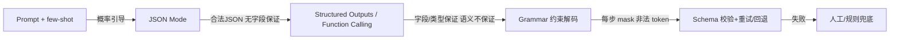

# 如何让LLM稳定输出JSON

## 面试问题

怎么让 LLM 稳定输出 JSON？请说明从提示工程到结构化输出与约束解码的不同方案、原理和工程取舍。

## 考察意图

1. **稳定性分层：** 能否区分合法 JSON、符合 schema、语义正确三件不同的事，并据此选择方案。
2. **方案光谱：** 是否知道从 prompt、JSON mode、function calling/structured outputs 到语法约束解码的完整谱系，以及各自在哪一层做约束。
3. **原理理解：** 能否解释约束解码为什么能从概率保证变成结构保证（logits mask、FSM/grammar、sampling 阶段约束）。
4. **工程取舍：** 是否清楚延迟、模型兼容、schema 表达力（anyOf、嵌套、additionalProperties）、流式输出、错误恢复之间的权衡。
5. **失败模式：** 知道字段缺失、枚举值漂移、数字精度、长文本截断、Markdown 包裹、注释/尾逗号等真实问题，以及生产上的校验和回退。

## 30 秒回答

1. **结论：** 不要只靠 prompt。让 LLM 稳定输出 JSON 的工业做法是**用 API 的 Structured Outputs / Function Calling 配 JSON Schema**，开源或自托管场景再叠加**语法约束解码**，把"格式正确"从概率问题变成解码阶段的硬约束。
2. **主链路：** 四层由弱到强——prompt + few-shot 只引导；JSON Mode 只保证整体是合法 JSON；Structured Outputs/Function Calling 保证字段名和类型；Outlines/Guidance/vLLM guided decoding 用 grammar/FSM 在每步采样时 mask 掉非法 token，保证语法与 schema 一致。
3. **取舍与边界：** 结构约束**不保证语义正确**——枚举可能取到 schema 允许但业务错误的值，数字可能精度漂移，长输出可能截断；因此生产链路仍要 schema 校验、容错解析、失败重试和降级。schema 越严（`additionalProperties:false`、必填字段、严格子集），命中率越高，但表达力越低、部分模型不支持。



*图：稳定输出 JSON 不是单点技巧，而是一条从软引导到硬约束、再到运行时校验的分层链路。*

## 2 分钟回答

**先把问题拆成三层。** 面试官问"稳定输出 JSON"时，实际可能指三件不同的事：第一是**语法合法**——能被 `json.loads` 解析，没有尾逗号、没有 Markdown 围栏、没有未转义引号；第二是**schema 合规**——字段齐全、类型正确、嵌套结构匹配；第三是**语义正确**——枚举值真的是业务期望的那个，数字精度正确，长字段没有被截断或胡编。三者难度递增，绝大多数方案只解决前两层，第三层必须靠业务校验和人工/规则兜底。这是回答整个问题的主线。

**最软的一层是纯 prompt。** 做法是在 system/user 消息里明确"只输出 JSON，不要解释"，给出目标 schema 和 1–3 个 few-shot 示例，把 `temperature` 调低、`top_p` 收紧，必要时要求模型先在思考标签里规划再输出。它的优点是模型无关、零依赖；缺点是**只提高概率不提供保证**——强模型在简单 schema 下能做到 99%+，但一旦输出变长、schema 变深、出现边界字符（引号、换行、中文、代码片段），或者模型经过指令微调偏向"先解释"，就会偶发地加上 Markdown 围栏、加注释、漏字段。这种方案在 demo 和低风险场景够用，但**不能作为生产系统唯一的格式保障**。

**第二层是 JSON Mode。** OpenAI、Azure、Together 等 API 提供 `response_format={"type":"json_object"}`，它在解码阶段强制输出是合法 JSON（底层通常是通过特殊 token、词表 bias 或训练目标实现），但**不保证字段**——你要 `name` 和 `age`，模型可能返回 `{"result": {...}}` 或自造字段。它适合"我只需要一个 JSON 对象、结构由后续代码宽松解析"的场景，比纯 prompt 强但不适合严格契约。

**第三层也是当前云端 API 的首选：Structured Outputs / Function Calling。** OpenAI 的 Structured Outputs（2024 年 8 月发布）允许传 JSON Schema 并开启 `strict: true`，在解码时约束模型必须按 schema 输出，支持必填字段、类型、枚举、嵌套对象和数组；它的实质是**把 schema 编译成解码时的 token 级约束**，并在拒绝时通过结构化的 refusal 字段返回，而不是污染 JSON。Anthropic 的 tool use、Google Gemini 的 `responseSchema`、Mistral 的 structured output 走类似路线——**用工具/函数定义作为 schema 载体，强制模型生成符合 schema 的参数 JSON**。这一层解决了"合法 + 合规"，是大多数 Agent、RAG、分类抽取任务的默认选择。需要注意它有 schema 子集限制：OpenAI 要求 `additionalProperties:false`、所有字段在 `required` 中、只支持部分 JSON Schema 关键字；不支持的 schema 会被 API 拒绝。

**第四层是开源/自托管场景的语法约束解码。** Outlines、Guidance、lm-format-enforcer、vLLM 的 guided decoding、SGLang、llama.cpp 的 GBNF 等，把 JSON Schema 或正则/上下文无关文法编译成有限状态机（FSM），在每步采样时**mask 掉所有不合法的下一 token**，从 softmax 之后的候选集合层面保证输出一定合法。这种方式可以挂在任何 HuggingFace 因果 LM 上，模型无关，且对 schema 的支持可以比云 API 更宽；代价是**解码变慢**（每步要查 FSM、mask logits）、需要 GPU 端推理控制权、对流式输出和动态 schema 有额外工程要求，且对 `anyOf`/`oneOf` 等复杂结构通常要展开为多份 FSM。

**工程上必须做的三件事不会被任何一层省掉。** 第一是**运行时校验**：用 Pydantic、jsonschema、zod 等在解析后做类型和约束校验，而不是信任模型；第二是**错误恢复**：解析或校验失败时，把错误信息连同原输出喂回模型让它修（"你输出的 JSON 在第 N 行有尾逗号，请修正后只输出 JSON"），通常 1–2 次重试就能恢复，比无限调 prompt 更有效；第三是**降级与兜底**：达到重试上限后走规则抽取（正则提取字段）、返回错误让上游决策，或对高风险场景转人工。流式输出还要处理**分片 JSON**——要么让模型输出 JSON Lines，要么在消费端做增量解析。

**最后是常见取舍。** 严格 schema 命中率更高但牺牲表达力——`additionalProperties:false` 会阻止模型加解释字段，但也让你无法接收"模型额外发现的有用信息"；枚举约束避免了拼写漂移，但遇到训练时没见过的新值会被迫选一个最接近的，产生**幻觉式合规**；嵌套过深会显著降低长输出的稳定性，必要时把结构扁平化或拆成多次调用；温度越低越稳定但可能牺牲质量和多样性。这些没有绝对答案，要按任务的容错度和模型能力来调。

## 原理拆解

### 1. 三个稳定性层次与对应手段

| 层次 | 含义 | 典型失败 | 解决手段 |
| --- | --- | --- | --- |
| 语法合法 | 可被 JSON parser 解析 | 尾逗号、未转义引号、Markdown 围栏、注释 | JSON Mode、约束解码 |
| Schema 合规 | 字段、类型、嵌套匹配 | 缺字段、自造字段、类型错误 | Structured Outputs / Function Calling |
| 语义正确 | 值在业务上正确 | 枚举漂移、数字精度、内容胡编、截断 | 业务校验、重试、人工兜底 |

**任何一层方案都不直接解决第三层。** 这是讨论稳定性时最容易被忽略的边界。

### 2. 四种方案的作用点对比

| 方案 | 作用层 | 保证 | 代价 | 典型场景 |
| --- | --- | --- | --- | --- |
| Prompt + few-shot | 提示 | 无硬保证 | 模型可能加解释/漏字段 | Demo、低风险分类 |
| JSON Mode | API/解码 | 整体是合法 JSON | 字段不保证 | 宽松结构、二次解析 |
| Structured Outputs / Function Calling | API + schema 编译 | 字段名、类型、必填、枚举 | schema 子集限制、可能不支持复杂结构 | Agent 工具调用、抽取、分类（云端首选） |
| 约束解码（Outlines/vLLM/Guidance） | 解码每步 logits mask | 语法 + schema 硬保证 | 延迟升高、需自托管、复杂 schema 支持有限 | 开源模型、强一致需求、批量任务 |

### 3. 约束解码的工作原理

```text
schema/正则/grammar
      │  编译
      ▼
   有限状态机 FSM（状态 = 当前在 JSON 中的位置）
      │
      ▼
每一步生成:
  1. LLM 产出 logits
  2. 查询 FSM：当前状态允许哪些 token
  3. 把不允许的 token 的 logits 设为 -inf
  4. 在剩余 token 上采样/贪心
  5. 推进 FSM 状态
```

因为在 softmax 之后、采样之前就把非法 token 屏蔽了，输出不可能走到非法状态，从而把"概率上很可能合法"变成"解码路径上必然合法"。JSON Schema 到 FSM 的编译通常会把对象 key 集合、数组括号、字符串闭合、数字格式都展开为状态转移；递归结构和 `anyOf` 会让 FSM 膨胀，这也是复杂 schema 下性能下降的原因。

### 4. 生产链路

```text
调用 LLM（带 schema/function 定义）
      │
      ▼
  接收输出 ── 流式？──► 增量解析（JSON Lines / partial JSON parser）
      │
      ▼
  json.loads / 模型 SDK 反序列化
      │
      ▼
  jsonschema / Pydantic 校验
      │
      ├── 失败 ──► 把错误喂回模型重试（最多 N 次）
      │              │
      │              └── 仍失败 ──► 规则兜底 / 降级 / 人工队列
      ▼
  业务规则校验（枚举、范围、引用完整性）
      │
      ▼
  进入下游
```

关键设计点：重试时**把原始输出和具体错误一起返回**，让模型做"修复"而不是重新生成；对幂等字段（ID、时间戳）在服务端填，不让模型生成；对可能很长的字段（理由、摘要）单独设上限并在截断时标记。

### 5. 真实失败模式清单

- **Markdown 包裹：** 模型输出 ```json ``` 围栏，纯 prompt 最常见；JSON Mode 通常可消除。
- **尾逗号/注释：** 模型把"代码风格"带进 JSON。
- **字段名漂移：** 用 `user_name` 代替 `username`，或加 `explanation` 字段（被 `additionalProperties:false` 拦下则模型可能拒绝）。
- **枚举漂移：** schema 允许 `["low","medium","high"]`，模型输出 `{"level":"Medium"}` 或 `"critical"`。
- **数字精度：** 长整数被序列化为科学计数法或浮点丢精度（如订单号），应让 ID 走字符串。
- **截断：** 长输出超过 `max_tokens`，JSON 在数组或字符串中间断掉。
- **空值与缺失：** 模型用 `null` 代替"不知道"，或省略字段——要在 schema 里明确 nullable 和 required。
- **Unicode 与转义：** 中文、emoji、换行未正确转义。
- **拒答混入：** 模型把"我不能回答"写进 JSON 字段；Structured Outputs 用独立的 refusal 通道隔离。
- **多对象/多 JSON：** 模型一次输出多个 JSON 块；需要明确"只输出一个对象"或用 JSON Lines。

## 递进追问与参考回答

### Q1：JSON Mode 和 Structured Outputs/Function Calling 有什么本质区别？

本质区别在**约束的粒度**。JSON Mode 只约束"输出整体是合法 JSON"，底层通常靠特殊 token 或训练目标实现，对字段结构一无所知；Structured Outputs 接收完整 JSON Schema 并在解码时按 schema 约束 token，因此能保证必填字段、字段名、类型、枚举和嵌套结构。Function Calling 走的是同一类机制，只是把 schema 包在工具定义里，让模型输出"工具调用参数 JSON"。如果下游需要稳定契约，优先 Structured Outputs/Function Calling；如果只想要"能 parse 的 JSON 然后自己宽松提取"，JSON Mode 就够。

### Q2：约束解码会不会降低模型输出质量？

会有条件地影响。**质量下降主要来自三处：** 一是 mask 把模型本想用来"思考"的标点或解释 token 屏蔽了，等价于强制模型直接给答案，少了隐式 CoT 的缓冲；二是严格 schema 让模型无法在不确定时通过额外字段表达不确定；三是某些 FSM 编译对复杂 `anyOf`/递归结构支持不全，可能强制模型走非最优分支。缓解办法是：在 schema 之外允许一个 `reasoning` 字段（OpenAI Structured Outputs 的"chain of thought"建议就是这种做法）、把任务拆成"先思考再输出"两次调用、或者只对最终答案做约束而中间思考用自由文本。简单 schema 下质量损失通常可忽略。

### Q3：Function Calling 算"稳定输出 JSON"吗？它和直接要 JSON 有什么差别？

算，而且是目前云端最可靠的实现之一。Function Calling 把"输出 JSON"重新定义为"调用某个函数并填参数"，schema 就是函数参数的 JSON Schema；SDK 通常会反序列化为结构化对象，而不是让你自己 `json.loads`。它的优势是模型经过专门的工具调用微调、API 侧做 schema 校验、错误以结构化方式返回；劣势是被绑在工具调用语义上，且不同厂商字段格式不完全统一。如果应用本身就是 Agent/工具驱动，Function Calling 是自然选择；如果只是纯抽取/分类，用 Structured Outputs 的 `response_format=json_schema` 更直接。

### Q4：schema 很复杂（深度嵌套、anyOf、长数组）时怎么处理？

四个思路。第一是**简化 schema**：把深嵌套拍平、把 `anyOf` 改成带 `type` 字段的判别联合（tagged union），让模型更容易学。第二是**分而治之**：第一次调用只输出顶层结构和 ID，第二次再对每个子对象分别抽取；这也是长文档抽取的常见做法。第三是**用约束解码而不是云 API**：Outlines、vLLM 对部分复杂 schema 支持更好，且可以本地控制 FSM 行为。第四是**放宽 strict**：在非关键字段允许 `additionalProperties`，把严格校验留给业务层。无论哪种，都要在 prompt 里给一个**完整的真实输出示例**，复杂 schema 下示例比 schema 文本本身更能引导模型。

### Q5：流式输出 JSON 怎么做？服务端能增量解析吗？

有三种模式。第一种是**JSON Lines / NDJSON**：模型逐行输出独立 JSON 对象，每行完整可 parse，最适合流式列表和事件流。第二种是**partial JSON parser**（如 `partial-json`、`jsonrepair`）：在字符流上容错解析未闭合的对象/数组，适合需要尽早拿到部分字段渲染的 UI。第三种是**结构化流式 + 字段级事件**：某些 SDK 在 schema 约束下会按字段触发回调，可以直接绑定到 UI 表单。要避免的做法是把整个 JSON 当字符串流拼接后再 `json.loads`——一旦中途截断就全部不可用。

### Q6：模型还是会偶发输出错字段或错枚举，怎么排查？

按从外到内的顺序查。先确认**你以为的 schema 和实际传给 API 的 schema 一致**（很多 bug 来自序列化丢字段、strict 没开、Pydantic 模型没设 `additionalProperties=False`）。再看**模型和版本**——小模型、旧模型、未对齐工具调用的开源模型在严格 schema 下命中率明显低。然后看**输出长度**：如果 `max_tokens` 不够，JSON 会被截断并表现为"字段缺失"。再看**prompt 里的示例**是否和 schema 一致，few-shot 与 schema 冲突是常见的隐性 bug。最后用一批真实失败样本做评估，区分"API 层就拒绝/返回 refusal"和"API 接受但业务校验失败"——前者调 schema，后者调业务逻辑、枚举设计或加 CoT。

### Q7：开源模型（Llama、Qwen、DeepSeek）做结构化输出怎么选？

优先级大致是：**模型自带的 chat template/工具调用能力 + vLLM/SGLang 的 guided decoding > Outlines/Guidance 外挂 > lm-format-enforcer > 纯 prompt。** vLLM 内置 `guided_json`、`guided_regex`、`guided_grammar`（GBNF），与多数主流开源模型兼容，是自托管生产最常见组合；Outlines 对 JSON Schema 支持完整、API 干净，适合研究和中小批量；Guidance 偏模板式编程，对需要在生成中插入程序逻辑的场景友好。同时要注意**模型的指令微调质量**——同样的约束解码，工具微调过的 checkpoint 在语义层命中率明显更高。

### Q8：数字、日期、布尔这些基础类型有什么坑？

三个最常见。**长整数**：超过 JS `Number.MAX_SAFE_INTEGER`（2^53−1）会被当浮点丢精度，订单号、雪花 ID 一律走字符串。**日期时间**：模型可能输出 `2026/8/11`、`Aug 11, 2026`、ISO 带时区等多种格式，schema 里用 `format: date-time` 并在 prompt 里明确要求 ISO 8601，业务层再 parse 校验。**布尔与"未知"**：模型倾向于输出 `null`、`"unknown"`、`"N/A"` 而不是 `false`，如果业务需要区分"否"和"未知"，要么用枚举（`"yes" | "no" | "unknown"`），要么显式给一个 `confidence` 字段。

## 常见错误回答

- **"在 prompt 里写'只输出 JSON'就行"**：只提高概率，强模型简单场景下能接近 100%，但无法保证；生产系统不应把它作为唯一手段。
- **"把 temperature 设为 0 就稳定了"**：低温度减少随机性，但不解决 schema 合规和长输出截断；temperature=0 仍可能因模型实现产生非确定结果，且不修复字段漂移。
- **"JSON Mode 就能保证字段正确"**：JSON Mode 只保证是合法 JSON，不保证字段名、类型、嵌套；这是和 Structured Outputs 最常见的混淆。
- **"用了 Function Calling 就不需要校验"**：Function Calling 保证结构，不保证语义；枚举值、引用完整性、业务规则仍要服务端校验。
- **"约束解码会让模型变笨"**：笼统结论。简单 schema 下影响可忽略；复杂任务要通过 CoT 字段或分阶段调用缓解，而不是放弃结构约束。
- **"给一个超大 JSON Schema 让模型一次性吐所有字段"**：深嵌套、长数组、anyOf 会显著降低命中率并增加截断风险，应拆分或简化。
- **"输出错了就无限重试"**：没有重试上限和错误归因，可能烧掉大量 token 仍失败；要带回具体错误信息、限次数，并设降级路径。
- **"用正则把 ```json 围栏剥掉就够了"**：这是补救手段，不是稳定性方案；剥围栏无法修复尾逗号、缺字段、截断等深层问题。
- **"Structured Outputs 支持所有 JSON Schema"**：主流 API 都只支持 JSON Schema 的一个严格子集（如 `additionalProperties:false`、字段必须 required、不支持部分关键字），需要按文档写 schema。

## 评分标准

**不合格（0–2）**

- 只知道"prompt 里要求 JSON"，不知道 JSON Mode/Structured Outputs/约束解码；
- 分不清合法 JSON、schema 合规、语义正确；
- 不了解任何失败模式或运行时校验。

**合格（3–4）**

- 能说出至少三层方案（prompt、JSON Mode、Structured Outputs/Function Calling、约束解码中的三层）；
- 理解 JSON Mode 与 Structured Outputs 的区别；
- 知道要做 schema 校验和失败重试；
- 能解释一两个常见失败模式（Markdown 围栏、截断、枚举漂移）。

**优秀（5–6）**

- 能完整画出四层方案光谱及各自的作用层与保证边界；
- 能解释约束解码的 logits mask/FSM 原理；
- 能讨论 schema 表达力 vs 命中率、流式 JSON、长输出截断、CoT 字段等工程权衡；
- 有开源模型 + vLLM/Outlines guided decoding 或云端 Structured Outputs 的实战经验；
- 明确结构正确不等于语义正确，能设计业务校验和降级路径。

**加分项**

- 提到 `additionalProperties:false`、strict 子集、refusal 通道等 OpenAI/Anthropic/Gemini 的具体细节；
- 讨论过 JSON Lines、partial JSON parser、字段级流式回调；
- 能讲清长整数精度、日期格式、布尔未知三态等基础类型陷阱；
- 了解 Outlines、Guidance、lm-format-enforcer、SGLang、GBNF 等开源工具的差异。

## 关联概念

- [[提示工程 Prompt Engineering]]
- [[ReAct Agent 工作原理]]
- [[设计一个Coding Agent]]
- [[AI Agent上下文窗口不足的工程应对]]
- [[思维链 Chain-of-Thought]]

## 来源核验

来源：

- OpenAI, *Structured Outputs 官方指南*, https://platform.openai.com/docs/guides/structured-outputs （Structured Outputs、strict schema、`additionalProperties:false`、refusal 通道的一手文档）
- OpenAI, *Introducing Structured Outputs in the API*, 2024-08-06, https://openai.com/index/introducing-structured-outputs-in-the-api/ （发布背景与设计动机）
- Anthropic, *Tool Use — Claude Docs*, https://docs.anthropic.com/en/docs/agents-and-tools/tool-use/overview （Claude 通过 tool use 强制生成符合 `input_schema` 的 JSON 参数）
- Google, *Gemini API: Structured output*, https://ai.google.dev/gemini-api/docs/structured-output （Gemini 的 `responseSchema` 与 config 约束）
- dottxt, *Outlines 文档*, https://dottxt-ai.github.io/outlines/ （开源 JSON Schema/正则约束解码的代表性实现）
- vLLM Team, *Structured Outputs — vLLM Docs*, https://docs.vllm.ai/en/latest/features/structured_outputs.html （vLLM guided decoding: JSON、regex、grammar 三种模式）

信度：中。各厂商官方文档对自家 API 的能力边界（strict 子集、`additionalProperties:false`、refusal、guided decoding）属于一手高信度来源；但本页未在本次会话中直接抓取这些页面（站点对自动化访问有限制），相关事实来自对这些公开文档长期内容的整理，因此整体 confidence 标为"中"。部署前建议根据所使用模型/SDK 的当前文档核对 schema 子集与字段名。

## 更新记录

- 2026-08-11: 首次建页；整理 prompt、JSON Mode、Structured Outputs/Function Calling、约束解码四层方案，明确合法/合规/语义三层次。
