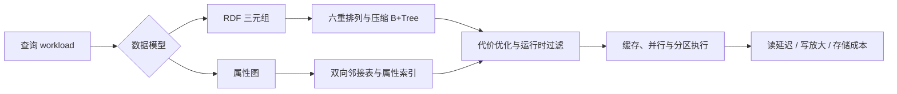

# 知识图谱的存储方式与索引优化

## 面试问题

如何去存储知识图谱，按照这种方式存储之后，如何提高索引的效率？

## 考察意图

1. **数据模型：** 区分 RDF 三元组与属性图，并说明它们同关系表、文档存储的取舍。
2. **访问路径：** 把存储结构、点查、邻域遍历、多跳路径、属性过滤和索引设计串起来。
3. **工程机制：** 解释六重索引、双向邻接表、字典编码、压缩 B+Tree、位图和物化视图。
4. **查询执行：** 说明代价优化器、连接顺序、运行时过滤、缓存和并行执行的作用。
5. **成本边界：** 按 workload 权衡写放大、存储膨胀、导入速度与查询延迟，而不是无条件增加索引。

## 30 秒回答

1. **结论：** RDF 以 `(S,P,O)` 三元组配六重排列索引，属性图以节点、边、属性和双向邻接表组织数据；选型由主要访问模式决定。
2. **机制：** 六重索引或邻接表覆盖一跳访问，字典编码与压缩降低 IO，类型/复合/位图索引和物化视图加速过滤与多跳，代价优化器选择执行计划。
3. **边界：** 索引会带来写放大、存储膨胀和导入成本，必须按 OLTP 点查、路径遍历、分析聚合或写密集 workload 取舍。

*图：存储模型先决定基本访问路径，再由二级索引和查询执行层优化；最终方案必须回到实际 workload 的读写成本。*

## 2 分钟回答

**先选数据模型。** RDF 把事实表示为 `(主体 S, 谓词 P, 客体 O)` 三元组。RDF-3X 为 `SPO/SOP/PSO/POS/OSP/OPS` 六种排列分别建立聚簇 B+Tree，使任意绑定模式命中索引；Hexastore 再用对象间直接引用把多跳 join 转成指针追踪。属性图把点、边和属性作为一等公民，通常使用按 label 分区的点表、双向邻接表和属性 KV 表，遍历沿邻接关系执行。

**再分层提速。** 物理层用字典编码、前缀压缩和列式布局减小单次 IO；索引层用 RDF 六重排列、属性图双向邻接表、类型/复合/位图索引和物化视图覆盖常见访问；查询层由代价模型选择 join 顺序，并结合 runtime filter、SIMD、多线程和图分区减少中间结果与跨机 shuffle。

**最后按 workload 取舍。** 六重索引把存储和写入放大到原始数据的数倍，不适合高写吞吐；属性图邻接表擅长路径遍历，但全局扫描和复杂多属性过滤较弱；位图适合低基数过滤，却有较高更新成本。点查与多跳优先属性图邻接索引，复杂 SPARQL 或分析聚合优先 RDF 六重索引与列存，超大规模图再增加分区和缓存。

## 原理拆解

### 1. 数据模型与存储范式

| 范式 | 逻辑结构 | 典型系统 | 访问优势 | 短板 |
| --- | --- | --- | --- | --- |
| RDF 三元组表 | 一张 `(S,P,O)` 表，六重排列索引 | RDF-3X、Hexastore、Jena TDB、Virtuoso | 任意绑定模式点查、SPARQL 语义清晰、便于集成推理 | 多跳需要多次自连接，存储膨胀 |
| 属性图 | 点、边带 label 和属性的有向图 | Neo4j、JanusGraph、NebulaGraph、TigerGraph | 一跳/多跳遍历是指针追踪，延迟低 | 跨 label 全局分析较弱，分布式一致性复杂 |
| 关系表加 EAV | 三元组或垂直分区表 | PostgreSQL 加扩展 | 事务、SQL 生态成熟 | 多跳 join 性能差 |
| 图处理引擎 | 邻接矩阵/CSR，批量分析 | GraphX、PowerGraph、GraphBLAS | BFS/PageRank/社区发现等批量算法高吞吐 | 不适合在线点查和事务更新 |

### 2. RDF 六重排列索引（RDF-3X / Hexastore）

对三列 `(S,P,O)` 有 $3! = 6$ 种排列。任意 SPARQL 基本图模式中，一个三元组模式的每个位置要么绑定常量，要么是变量；至少有一棵索引的前缀是绑定列，因此能走索引扫描而不是全表扫：

- `S=?, P=?, O=?`：SPO
- `S=?, P=?`：SPO 前缀
- `P=?, O=?`：POS 前缀
- `O=?, S=?`：OSP 前缀
- 单变量绑定或仅过滤某列：任意以该列开头的索引

RDF-3X 还做了几件关键工程优化：

- **字典编码（dictionary encoding）**：所有 URI/字面量映射为 64 位整数，索引里只存定长整数，比较和压缩都快；
- **压缩聚簇 B+Tree**：六棵 B+Tree 都是聚簇索引，叶子页用前缀压缩、null 压缩和差值编码，磁盘占用远低于 6 倍；
- **延迟聚合 / sideway result passing**：把 join 中间结果以紧凑形式传递，减少物化；
- **代价优化器**：对 SPARQL 做 bushy join 枚举，结合运行时采样选择计划。

Hexastore 则在六重索引之上让对象之间直接持有"邻居列表"，把多跳路径变成嵌套的链表遍历，避免重复 B+Tree 查找；代价是写入时要维护六份邻居指针。

### 3. 属性图存储

以 Neo4j 为代表：

- **节点记录**：定长记录，保存首个 label、首个属性记录 id、首条出边/入边 id；
- **关系记录（边）**：双向链表结构，每条边记录起点、终点、type、前后同起点边、前后同终点边，使得"给定点的出边/入边"是顺序遍历；
- **属性记录**：链表形式，按 name 到 value 存储，定长内联小值，大值溢出到动态存储；
- **索引**：对 label 加 property 建 B+Tree（或 Lucene 全文索引），支持点查和范围扫描；schema 索引可设为 uniqueness 约束，自动升级为主键式查找。

分布式图存储（JanusGraph、Nebula、TigerGraph）通常在邻接表基础上叠加：

- **图分区**：按点 ID 哈希分片，结合边切（edge-cut）/点切（vertex-cut）策略；
- **CSR / 只读快照**：分析负载把邻接表压成 CSR，多跳遍历是连续内存读；
- **二级索引后端**：ES/Lucene/RocksDB 承担属性过滤和全文检索。

### 4. 索引提速的通用手段

按从数据到查询的层次梳理：

1. **物理布局层**
   - 字典编码、ID 化：把字符串比较变成整数比较；
   - 压缩 B+Tree / LSM：降低单页 IO，LSM 适合写密集；
   - CSR / 邻接数组：把遍历从随机 IO 变成顺序读。
2. **索引结构层**
   - 六重排列（RDF）或双向邻接表（属性图）：一跳必中；
   - 复合索引：按访问模式设计前缀，例如 `(label, created_at)`；
   - 位图索引：低基数列（性别、状态、类型）；
   - 全文/向量索引：Lucene/HNSW 用于文本和语义检索；
   - 空间索引（R-Tree/Quadtree）：地理属性过滤。
3. **语义/模式层**
   - 类型/label 索引：按实体类型分桶，避免扫全图；
   - 物化视图：高频星形/路径查询结果物化，定期或增量刷新；
   - 图摘要 / 类型化索引（type index）：在 RDF-3X 中为高频 P 建立聚合索引；
   - 规则/推理结果物化：传递闭包、subClassOf 链预计算。
4. **查询执行层**
   - 代价优化器加动态计划：基于基数估计选择 join 顺序；
   - Sideway result passing / runtime filter：把一侧的 join key 用 bloom filter 下推到另一侧；
   - 并行与向量化：多线程扫描、SIMD 过滤；
   - 缓存：热点点/边、字典页、查询结果缓存。

### 5. 写入与存储的代价

- 六重索引写入时要更新 6 棵 B+Tree，写放大显著；Hexastore 还要维护邻居链表；
- 位图索引和物化视图对批量导入友好、对高频单点更新不友好；
- 邻接表的双向边让遍历快，但插入一条边要同时更新两个点的链表；
- 分布式下，跨分区边（远程边）会把一次一跳变成一次 RPC，需要通过点切/复制热点点缓解。

## 递进追问与参考回答

### Q1：为什么 RDF-3X 要建六棵索引，三棵或四棵不够吗？

六种排列是覆盖"任意绑定位置组合"所必需的下界。如果只有 SPO/POS/OSP（按每列轮转一颗），那么像 `?s :friend :alice` 这种只绑 P 和 O、且 P 在 POS 中是首列的，可以命中 POS；但当谓词固定、客体有序要做范围扫描，需要 POS；当客体固定且要按主体排序分组，需要 OSP；当只绑主体且要按谓词/客体排序，需要 SPO。RDF-3X 的代价优化器依赖这些排列把 join 变成 merge join，缺一棵就可能退化成排序或哈希连接，性能不稳定。六棵的额外存储在压缩后通常只比裸数据大数倍以内，是划算的工程折中。

### Q2：属性图为什么普遍不照搬六重索引？

属性图的一等访问模式是"给定一个点，沿某种边类型跳到邻居"，这正是双向邻接表天然覆盖的，不需要在三列上枚举排列。属性图的点/边属性是动态 KV，不像 RDF 那样所有事实都平铺成三元组，建六重索引会把属性更新放大成大量索引维护。属性图把"属性过滤"交给二级索引，把"路径遍历"交给邻接表，两种 workload 用不同结构，避免六重索引的写放大。

### Q3：多跳查询（比如三跳好友推荐）怎么加速？

- **邻接表加 CSR**：一跳是指针追踪/顺序读，三跳通常可以纯内存完成；
- **剪枝**：在每跳按边类型、时间、权重过滤，越早缩小邻居集越好；
- **双向 BFS**：从起点和终点同时扩展，在中间相遇，复杂度从 $O(b^d)$ 降到 $O(b^{d/2})$；
- **预算剪枝 / 采样**：对推荐类查询，每跳只保留 top-K 候选；
- **预计算/物化**：把高频多跳关系（如"好友的好友"）离线算成虚拟边或视图；
- **图分区与缓存**：让热点子图落在同一台机器、同一 NUMA 节点，减少跨机和跨 NUMA 访问。

### Q4：RDF-3X 的压缩为什么不会拖慢查询？

因为它的压缩是页内轻量压缩（前缀压缩、差值编码、null 压缩），解压在 CPU cache 中完成，远快于磁盘 IO；同时字典编码让索引只存定长整数，比较和移动都比字符串快。换言之，压缩减少的 IO 节省远超解压的 CPU 开销。这也是"列式存储加压缩"在分析负载里普遍更快的原因。

### Q5：分布式知识图谱怎么做索引？

- **点 ID 哈希分区**：同一点的所有邻接边落在同一分片，一跳基本是本地操作；
- **边切 vs 点切**：边切把边复制到两个端点机器，点切把高点度复制到多机，按图的度分布选；
- **全局二级索引**：用 ES/RocksDB 维护属性到点 ID 的映射，索引本身可按 key 范围分片；
- **邻居缓存加远程边批处理**：把跨分片的一跳访问批量合并成一次 RPC；
- **图摘要 / 路由索引**：在协调器维护每个分片拥有的 label/类型摘要，查询先路由到可能命中的分片，避免全分片扫描。

### Q6：如果 workload 是写入极多、查询很少，还要建六重索引吗？

不要。写密集场景应：

- 用 LSM 类存储（RocksDB）替代 B+Tree，把随机写变成顺序写；
- 只保留最必需的前缀索引（例如只保留 SPO 加 OSP），把排序/聚合放到读时或离线；
- 批量导入期间临时关闭索引，导入完成后一次性构建；
- 用追加式事实表加增量物化视图，把索引维护成本摊销到后台。

## 常见错误回答

- **"用关系库三张表存就行"**：只能覆盖最简点查，多跳查询会变成多次自连接，性能在百万级边以上迅速恶化；而且关系库通常不会自动给三列的所有排列建索引。
- **"建越多索引越快"**：索引有写放大和存储成本，六重索引在写密集场景会把吞吐显著拉低；要按 workload 设计访问路径，而不是无脑加索引。
- **"Neo4j 快是因为它免索引邻接（index-free adjacency）"**：免索引邻接指的是遍历沿邻接表指针走、不用二次查索引，但点本身的查找和属性过滤仍需要索引；把它理解成"完全不用索引"是常见误读。
- **"RDF 就是关系表的三列"**：RDF 有开放世界语义、推理、命名图等机制，工程实现也围绕六重索引和字典编码做了大量优化，和朴素三列表差别很大。
- **"位图索引是万能的"**：位图适合低基数列，高基数列（用户 ID、时间戳）位图稀疏且更新昂贵，应选 B+Tree/LSM。
- **"图数据库自带的查询优化器什么都能优化"**：基数估计在高度倾斜的幂律图上经常失准，复杂多跳仍需要手动加方向、类型和 limit 提示。

## 评分标准

**不合格（0–2）**

- 只说"用 MySQL/MongoDB 存"，讲不出数据模型差异；
- 把索引等同于"给主键加索引"，不知道六重排列和邻接表；
- 完全没有写放大和 workload 取舍意识。

**合格（3–4）**

- 能区分 RDF 三元组表和属性图，说出 1–2 种代表系统；
- 知道 RDF-3X 的六重索引、属性图的邻接表；
- 能给出至少 3 种索引提速手段（复合索引、字典编码、类型索引、位图、物化视图、CSR 等）；
- 提到写入代价和读写权衡。

**优秀（5–6）**

- 能解释六重索引为什么是 6 棵、压缩为什么不拖慢查询、属性图为什么不照搬六重索引；
- 能把存储结构、访问模式、查询优化器三层串起来；
- 能针对具体 workload（OLTP 点查 / 图分析 / 写密集 / 分布式）给出选型和取舍；
- 能讨论多跳加速（双向 BFS、剪枝、物化、分区）和分布式远程边问题。

**加分项**

- 提到 RDF-3X 的 sideway result passing、Hexastore 的嵌套邻居列表；
- 提到 CSR、GraphBLAS、PowerGraph 等分析型图存储；
- 能指出幂律图对基数估计和分区的挑战。

## 关联概念

- [[知识图谱 KG]]
- [[主流知识图谱 Mainstream KGs]]
- [[FinGraph 财务知识图谱]]
- [[TransE 图嵌入]]
- [[关系图卷积网络 RGCN]]
- [[信息检索 IR基础模型 Information Retrieval]]

## 来源核验

来源：

- Thomas Neumann, Gerhard Moerkotte: *RDF-3X — A RISC-style Engine for RDF*, PVLDB 2008（六重排列索引、压缩聚簇 B+Tree、字典编码、代价优化器的一手来源）
- Cathrin Weiss, Panagiotis Karras, Abraham Bernstein: *Hexastore — Sextuple Indexing for Semantic Web Data Management*, PVLDB 2008（六重索引与邻居直接引用的一手来源）
- Neo4j Cypher Manual: Indexes for Search Performance, https://neo4j.com/docs/cypher-manual/current/indexes-for-search-performance/ （属性图索引类型与限制的官方文档）
- Renzo Angles, Claudio Gutierrez: *Survey of Graph Database Models*, ACM Computing Surveys 2008（图数据模型对比综述）

信度：高。上述来源均为同行评审论文或官方文档，描述的机制（六重排列、字典编码、压缩 B+Tree、双向邻接表、索引类型）在多个独立系统中复现。

## 更新记录

- 2026-08-01: 按快速复习优先的正文层级重排重点、段落与技术图，事实和来源口径不变。
- 2026-07-31: 首次建页
