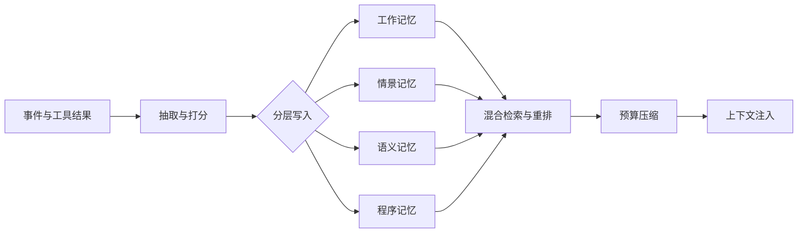

# 设计一个AI Agent的记忆系统

## 面试问题

请设计一个 AI Agent 的记忆系统，需要说明记忆分层、读写机制、检索策略和工程取舍。

## 考察意图

1. **目标判断：** 记忆系统不是“存得下”，而是“在对的时刻把对的信息放进有限的上下文窗口”。
2. **系统分层：** 区分工作记忆、情景记忆、语义记忆和程序记忆，并说明每层的物理载体与生命周期。
3. **端到端链路：** 串起写入、存储、检索、重排、压缩、反思和上下文注入。
4. **工程取舍：** 讨论上下文预算、检索延迟、token 成本、新鲜度、一致性和租户隔离。
5. **方案边界：** 理解 Generative Agents、MemGPT/Letta 与普通 RAG 的控制权差异。

## 30 秒回答

1. **结论：** Agent 记忆应分为工作、情景、语义和程序四层，不能把一个向量库当成完整记忆系统。
2. **机制：** 写入侧完成抽取、向量化、打分与冲突合并，读取侧执行混合检索、重排、压缩和上下文注入。
3. **边界：** 核心取舍是召回率与上下文预算、检索延迟与 token 成本、新鲜度与稳定性；摘要必须保留回到原始事件的指针。

*图：主链路从事件写入四层记忆，再经混合检索、预算压缩进入上下文；四层共享检索入口，但载体和生命周期不同。*

## 2 分钟回答

**先分层。** 第一层工作记忆是当前的 prompt/上下文，保存任务状态、短期计划和最近 N 轮对话；第二层情景记忆保存历史事件、观察、动作和反馈，一般用按时间与会话分片的向量数据库；第三层语义记忆保存跨会话的用户档案、实体关系和领域知识，使用知识图谱或结构化 KV；第四层程序记忆固化技能、工具用法、prompt 模板和工作流。

**再设计读写链路。** 写入侧抽取实体、意图和长期偏好，为文本建立 embedding 与关键词索引，对敏感数据做脱敏和租户隔离，再按重要性决定写入层级。读取侧按“检索—重排—压缩—注入”执行：并行做向量、BM25 和图检索，用 cross-encoder 或 LLM 重排，按 token 预算取 top-K，最后以固定模板和来源 ID 注入上下文。

**关键机制控制规模和一致性。** TTL 与时间衰减把旧记忆降级到冷存储；写时去重和版本化合并避免偏好冲突；MemGPT/Letta 式分页让 agent 在主上下文与外部存储之间换入换出；离线任务成功率、记忆命中率与引用准确率，加上在线 A/B，检验记忆是否真的改善任务。

**最后说明边界。** 所有记忆都进入上下文会爆窗口并稀释注意力，因此必须按需检索；只靠向量检索会漏掉精确事实和结构化关系，需要关键词与 KG 补位；反思和摘要会丢细节并引入幻觉，必须保留回到原始事件的指针；跨用户共享默认采用租户隔离。

## 原理拆解

### 1. 记忆分层与载体

| 层级 | 存什么 | 物理载体 | 生命周期 | 典型访问模式 |
| --- | --- | --- | --- | --- |
| 工作记忆 | 当前对话、计划、scratchpad | LLM 上下文窗口 / scratchpad | 单会话或单任务 | 全量可见 |
| 情景记忆 | 观察、动作、工具调用结果、反馈 | 向量库 + 时间序存储（如 Postgres + pgvector） | 天–月，可归档 | 语义+时间过滤 |
| 语义记忆 | 实体、关系、用户偏好、领域事实 | 知识图谱 / 结构化 KV / 文档库 | 长期，需版本化 | 点查、图遍历、过滤 |
| 程序记忆 | 技能、工具用法、SOP、prompt 模板 | 代码仓库 / 技能库 / 向量索引 | 长期，随代码发布 | 按任务类型检索 |

### 2. 写入流水线

1. **事件捕获**：把 user message、agent thought、tool call、tool result、最终回答统一成事件流，带 `session_id`、`timestamp`、`actor`、`importance` 等元数据。
2. **抽取与打标**：用小模型或规则抽取实体、意图、情感、是否为长期偏好（如"我对花生过敏"），并给事件打重要性分。
3. **向量化与索引**：为可检索文本生成 embedding，写入向量库；同时写关键词倒排；结构化事实写入 KG 或关系表。
4. **去重与冲突合并**：对语义记忆做 upsert，新偏好覆盖旧偏好但保留版本历史；情景记忆只做近重复去重，不覆盖。
5. **脱敏与隔离**：写入前过 PII 检测器，按 `tenant_id`/`user_id` 做行级隔离或物理分库。
6. **异步反思**：后台任务定期把近期事件聚合成高层洞察（Generative Agents 的 reflection），写入语义记忆并链接回原始事件。

### 3. 检索与注入流水线

1. **查询构造**：基于当前任务，由 agent 或独立模块生成检索 query，可以带时间范围、实体、记忆类型过滤。
2. **混合检索**：并行执行向量检索、BM25/关键词、图查询（如"用户最近订单涉及的商家"），并按类型聚合。
3. **重排**：用 cross-encoder 或轻量 LLM 对候选做相关性打分，结合重要性、时间衰减、访问次数得到最终分。
4. **预算控制**：按 token 预算截断；超预算时用摘要替代原文，但保留 `memory_id` 指针。
5. **结构化注入**：用明确的 prompt 段（如 `<memory>`、`<user_profile>`）区分记忆来源，避免和当前指令混淆，并提示模型"记忆可能过时，使用前先核对"。
6. **引用与可追溯**：回答中引用的事实带回 memory ID，便于审计和纠错。

### 4. 关键机制

- **重要性打分**：训练或启发式给事件打分（影响用户目标、含长期偏好、情感强度高），高分优先保留。
- **时间衰减与访问强化**：分数随时间衰减、被检索后增强，模拟人类记忆的遗忘曲线。
- **反思与摘要**：把一批相关事件总结成更高层结论，降低注入成本；Generative Agents 用 LLM 生成问题并递归汇总。
- **分页式管理（MemGPT/Letta）**：主上下文是有限内存，外部存档是磁盘，agent 通过 `core_memory_append`、`archival_memory_insert`、`archival_memory_search` 等函数自行管理换页。
- **遗忘与合规删除**：支持按用户/时间删除，满足 GDPR 等"被遗忘权"；删除要级联到摘要和向量索引。
- **一致性与并发**：语义记忆的更新要加版本号或乐观锁，避免多 agent 并发写入互相覆盖。

### 5. 工程取舍

- **召回 vs 精确**：向量召回高但精度低，加 rerank 和 KG 提升精度但增加延迟。
- **上下文预算 vs 信息量**：塞太多记忆稀释注意力，应只注入与当前决策强相关的条目。
- **同步 vs 异步写**：同步写保证一致性但增加首字节延迟，通常把检索关键路径做同步、抽取和反思做异步。
- **自建 vs 托管**：向量库可选用 pgvector（数据少、事务强）、Qdrant/Weaviate（中等规模）、托管服务（运维省）；KG 在小规模用 Postgres 递归 CTE，大规模用 Neo4j/Nebula。
- **成本**：embedding 和 LLM 摘要都是持续成本，需要对写入做采样（只对重要事件 embed）和分层缓存。

## 递进追问与参考回答

### Q1：向量库不是已经能做记忆了，为什么还要知识图谱和程序记忆？

向量库擅长"语义相似的模糊召回"，但不擅长精确事实、关系遍历和多跳推理。比如"用户上个月下单的商家所在城市"这种问题，向量检索只能召回相关文本片段，而 KG 一次关系遍历就能给出确定答案。程序记忆解决的是另一个问题：怎么做（技能和工具用法），而不是知道什么；把常用工作流固化成可检索的技能，比每次靠 LLM 重新规划稳定得多。三层记忆各司其职，向量库是底座但不是全部。

### Q2：怎么决定一条信息该不该写进长期记忆？

可以用一个轻量分类器或小 LLM 在写入时打四个信号：**是否跨会话有用**（用户偏好、长期目标、身份信息）、**是否影响未来决策**（约束、禁忌、承诺）、**是否可从外部复现**（能从数据库/API 重新查到的就不必记）、**是否敏感**（敏感信息默认不记或加密）。四信号满足"跨会话有用 + 影响决策 + 不易复现"才进语义记忆，其余只进情景记忆或丢弃。重要性分要可解释，方便用户查看和删除。

### Q3：记忆之间互相矛盾怎么办？比如用户先说喜欢 A，后来说喜欢 B。

语义记忆必须做版本化 upsert 而不是 append-only：新事实覆盖旧事实，但保留历史版本和时间戳，便于追溯和回滚。检索时默认取最新版本，但如果旧版本仍在有效期（如订单偏好）则按时间范围过滤。冲突检测可以在写入时用规则或 LLM 判断"新事实是否与已有事实矛盾"，矛盾时触发合并或让 agent 在下一轮对话中确认。情景记忆保留两条原始事件，不互相覆盖。

### Q4：多轮对话很长，怎么避免上下文爆窗口？

组合使用：滚动摘要（把超过 N 轮的对话压成一段摘要）、消息裁剪（只保留最近若干轮和带决策的关键轮）、外置检索（把完整历史存向量库，按需检索）、分页管理（MemGPT 风格让 agent 自己换页）。关键是**不要简单截断**，要保留决策点、用户明确表达的约束和未完成的任务，并在摘要里写指针指向原始事件，便于需要时回查。

### Q5：怎么做记忆系统的评估？

分三层。**离线**：构造一组有标准答案的任务（如"用户的 X 偏好是什么"、"上次 Y 问题怎么解决的"），测量命中率、召回率、引用准确率、注入 token 数和延迟。**闭环**：把记忆接入真实 agent，看任务成功率、平均轮数、用户纠错率是否改善。**在线**：A/B 试验，指标包括用户满意度、人工评分、记忆被引用次数和被用户纠正次数。还要测"反事实鲁棒性"——故意给错误记忆，看模型会不会盲从。

### Q6：跨用户或跨 agent 共享记忆要注意什么？

默认租户隔离，共享必须显式 opt-in。共享前做 PII 脱敏；区分"全局知识"（产品文档、公开 FAQ）和"个人记忆"（用户偏好、对话历史），前者可全局只读，后者严格按 `user_id` 隔离。多 agent 协作时，共享的通常是黑板/任务状态而不是私有记忆，避免一个 agent 的错误记忆污染另一个。审计日志要记录"哪条记忆在什么时候被谁读取/写入"，便于合规和调试。

### Q7：MemGPT 的分页思路和直接做 RAG 有什么本质区别？

RAG 是"应用层在每次请求前检索并拼 prompt"，记忆对模型是被动数据；MemGPT 让 LLM 自己通过函数调用管理上下文——它决定何时把旧消息换出到 archival memory、何时搜索、何时把结果换入主上下文，类似 OS 的虚拟内存。区别在于控制权：RAG 由应用决定注入什么，MemGPT 由模型自己决定读写什么。适合长任务、自主 agent；不适合需要严格确定性注入的场景（合规、客服）。

## 常见错误回答

- **"挂个向量库就是记忆系统"**：向量库只解决了情景记忆的相似检索，没有分层、没有结构化事实、没有反思和遗忘，也没有写入质量控制。
- **"把所有历史都塞进上下文"**：既受窗口限制，又会稀释注意力（lost in the middle），还会显著推高成本和延迟。
- **"记忆只写不改"**：用户偏好会变化，append-only 会导致检索到相互矛盾的事实并让模型困惑；语义记忆必须支持 upsert 和版本化。
- **"检索到什么就注入什么"**：没有重排、去重、预算控制和冲突解决，容易把无关或过时记忆塞进 prompt。
- **"摘要完就把原文删掉"**：摘要会丢细节和引入幻觉，必须保留指针链回原始事件，支持回查和审计。
- **"全局共享一份记忆"**：忽略租户/用户隔离和合规，存在数据泄露和被遗忘权风险。
- **"只看召回率，不看引用准确率和任务成功率"**：记忆系统的目标是帮助 agent 做对决策，不是"记得多"。

## 评分标准

**不合格（0–2）**

- 把记忆等同于向量库或长上下文，说不出分层；
- 没有写入质量控制和检索后处理；
- 完全不考虑上下文预算、成本、隔离和遗忘。

**合格（3–4）**

- 能讲清工作/情景/语义/程序四层，以及对应载体；
- 能描述"写入—检索—重排—注入"主流程；
- 知道向量库+KG+摘要组合，提到至少 3 个工程取舍（预算、延迟、成本、新鲜度、隔离）。

**优秀（5–6）**

- 能解释 MemGPT 分页、Generative Agents 反思、重要性打分与时间衰减等机制；
- 能针对矛盾更新、长上下文压缩、多租户隔离、评估指标给出具体方案；
- 能把记忆系统和 agent 的规划、工具调用、纠错闭环串起来，知道何时不该用记忆（可从 API 实时查到的信息不必记）。

**加分项**

- 提到记忆的"反事实鲁棒性"测试和 prompt 注入风险（恶意记忆操纵 agent）；
- 能讨论记忆的可解释性和用户可见/可编辑；
- 了解 GraphRAG / 结构化记忆 + 向量记忆混合架构。

## 关联概念

- [[Agent 记忆架构]]
- [[ReAct Agent 工作原理]]
- [[多智能体系统 Multi-Agent Systems]]
- [[GraphRAG 架构]]
- [[知识图谱 KG]]
- [[信息检索 IR基础模型 Information Retrieval]]

## 来源核验

来源：

- Park et al., *Generative Agents: Interactive Simulacra of Human Behavior*, UIST 2023, https://arxiv.org/abs/2304.03442 （记忆流 memory stream、重要性打分、recency/importance/relevance 检索、reflection 反思机制的一手来源）
- Packer et al., *MemGPT: Towards LLMs as Operating Systems*, 2023, https://arxiv.org/abs/2310.08560 （分层记忆、主上下文/archival memory、函数调用换页的一手来源）
- Letta Documentation: Memory Concepts, https://docs.letta.com/concepts/memory （MemGPT 思想工程化后的官方文档，定义 core memory / archival memory / recall memory）
- Anthropic, *Building Effective Agents*, 2024, https://www.anthropic.com/engineering/building-effective-agents （agent 系统中上下文、工具、状态管理的工程实践）

信度：高。Generative Agents 和 MemGPT 是同行评审/被广泛引用的一手论文；Letta 文档是 MemGPT 团队官方材料；Anthropic 工程文章给出了工业界视角的最佳实践。

## 更新记录

- 2026-08-01: 按快速复习优先的正文层级重排重点、段落与技术图，事实和来源口径不变。
- 2026-07-31: 首次建页
